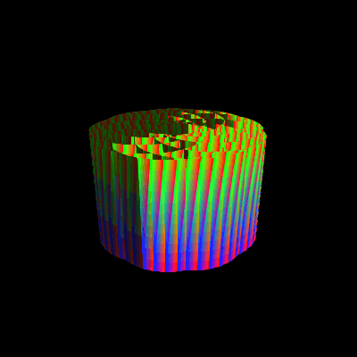
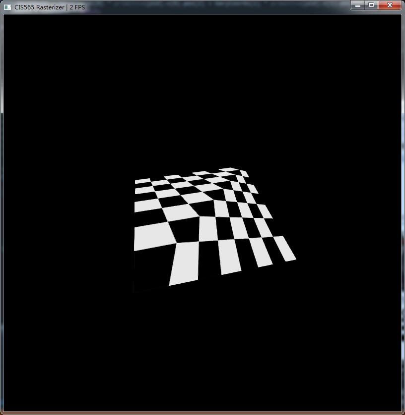
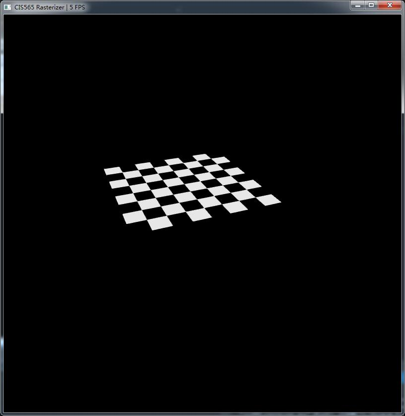
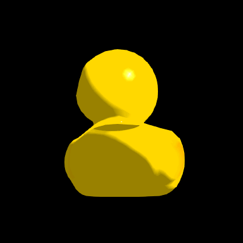
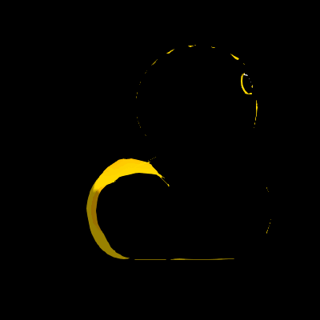
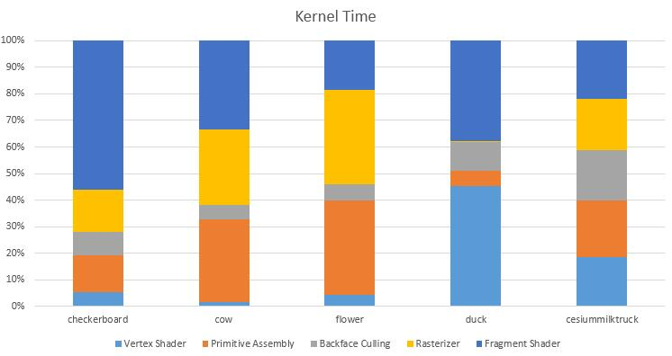
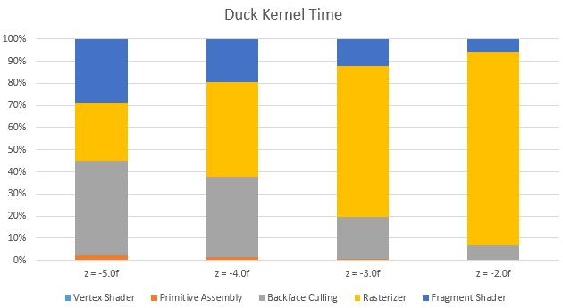
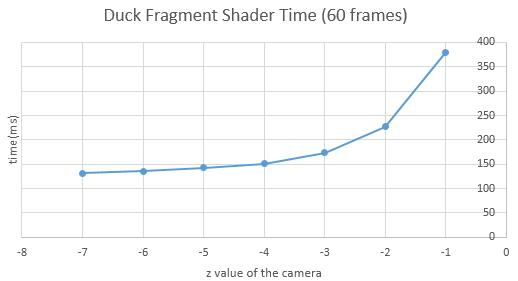
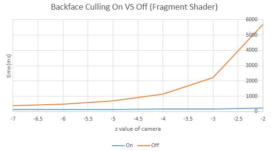
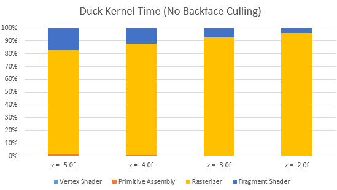

CUDA Rasterizer
===============

**University of Pennsylvania, CIS 565: GPU Programming and Architecture, Project 4**

* Kaixiang Miao
* Tested on: Windows 7, i7-3630QM @ 2.40GHz 8GB, GTX 660M 2GB (Lenovo Y580 laptop, personal computer)

### Screenshot

----------------

#### Perspective-correct Color Interpolation
<table class="image">
<tr>
	<td>duck.gltf (Blinn-Phong)</td>
	<td>cow.gltf (Blinn-Phong)</td>
	<td>flower.gltf (Lambert)</td>
</tr>
<tr>
	<td></td>
	<td></td>
	<td></td>
</tr>
</table>

#### Bilinear Texture Mapping
<table class="image">
<tr>
	<td>duck.gltf</td>
	<td>CesiumMilkTruck.gltf</td>
</tr>
<tr>
	<td></td>
	<td></td>
</tr>
</table>

#### Perspective-correct Texture Mapping
<table class="image">
<tr>
	<td>Bad Mapping</td>
	<td>Nice Mapping</td>
</tr>
<tr>
	<td></td>
	<td></td>
</tr>
</table>

#### Bilinear Texture Mapping
<table class="image">
<tr>
	<td>Bilinear Off</td>
	<td>Bilinear On</td>
</tr>
<tr>
	<td></td>
	<td></td>
</tr>
</table>

#### Backface Culling
<table class="image">
<tr>
	<td>Backface Culling Off</td>
	<td>Backface Culling On</td>
</tr>
<tr>
	<td></td>
	<td></td>
</tr>
</table>

###Performance Analysis

#### Kernel Time of Different Stages

The kernel time of different stages of different .gltf files is shown as below. However, in spite of the fixed distance from the object, the objects have different scale factors, which make the stacked chart below less meanningful.

Instead of comparing different objects, different distance from the object `duck.gltf` to the opsition of the camera is applied.

As the camera getting closer and closer, the rasterizer stage takes up more time. It illustrates that as the object taking up more and more area of the screen, the workload of the rasterizer becomes heavier because of the large area of primitives and more pixels needed to be filled by scanline.

The following graph shows the duration of the **fragment shader** of `duck.gltf`. Although the value is increasing, the ratio of this stage is decreasing, because of the steeper increase of the duration of the **rasterzier stage**. Besides, the duration of the **vertex shader**, the **primitive assembly** and the **backface culling** does not vary much because the number of vertices, primitives and backfaces is not relevant to the distance.

#### Backface Culling

Backface Culling reduce lots of execution time of both fragment shader and the rasterizer stage.

With no backface culling, the stacked chart appears different from the one shown at the beginning. The rasterizer stage takes up most duration because the rasterizer is shading numerous redundant primitives.

### Credits

* [tinygltfloader](https://github.com/syoyo/tinygltfloader) by [@soyoyo](https://github.com/syoyo)
* [glTF Sample Models](https://github.com/KhronosGroup/glTF/blob/master/sampleModels/README.md)
