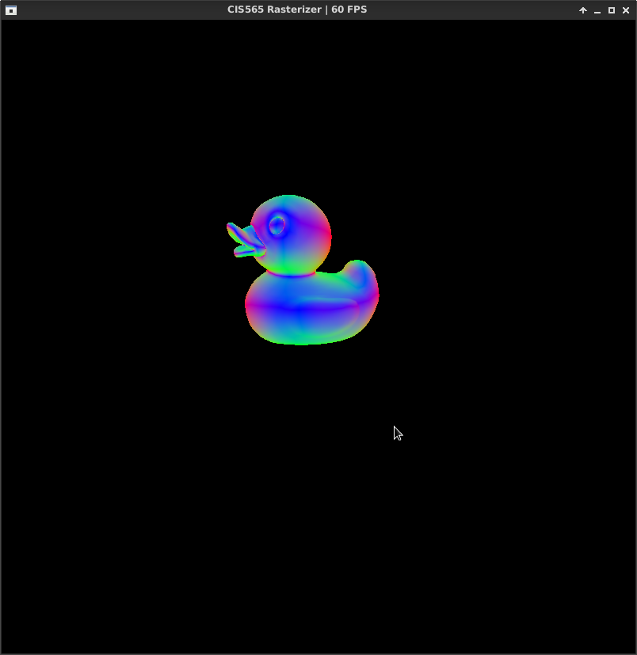
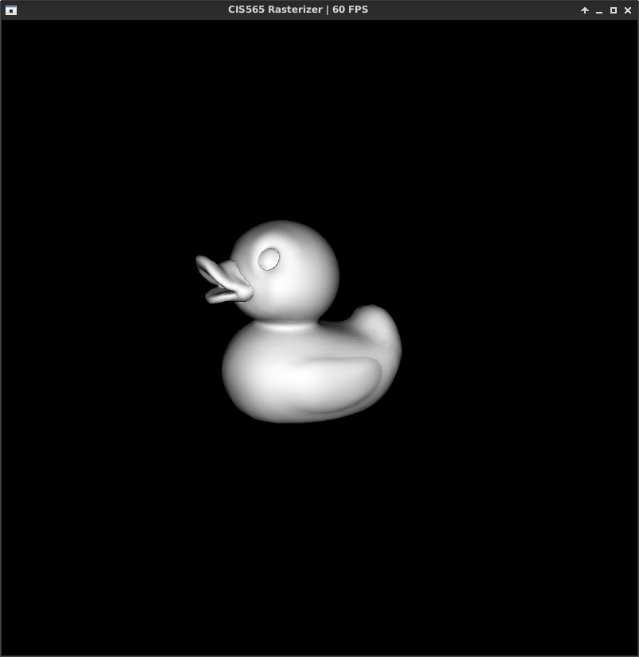
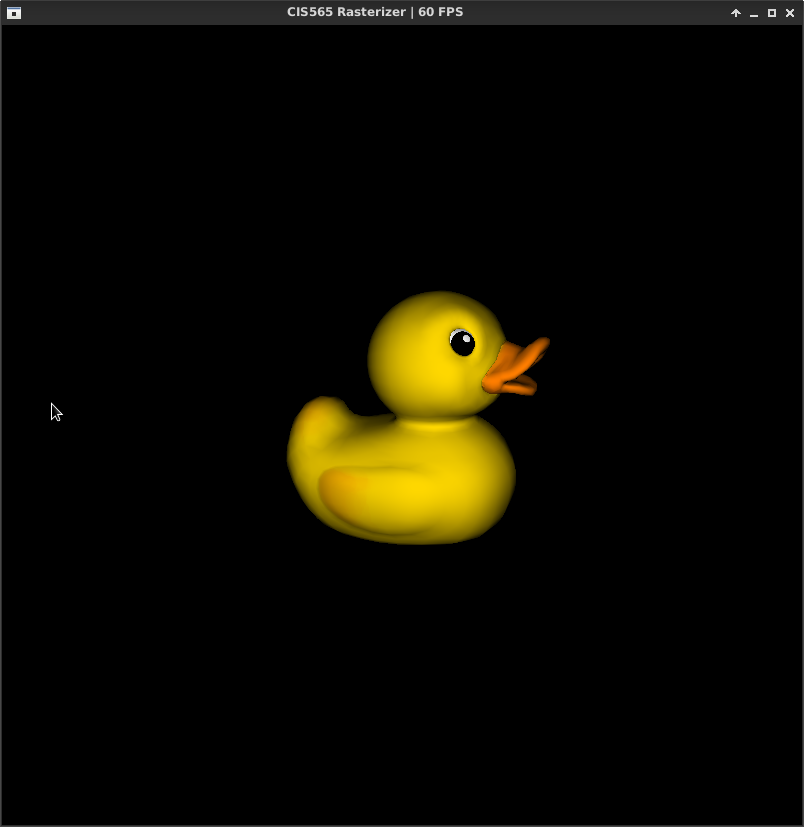
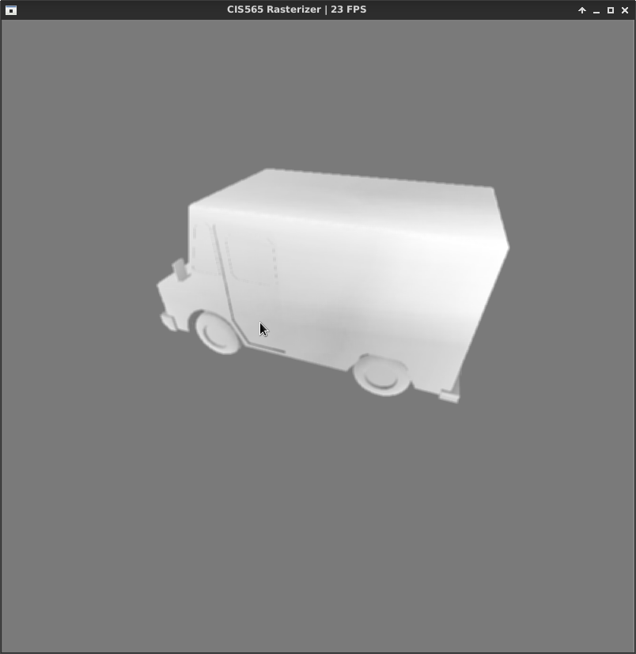
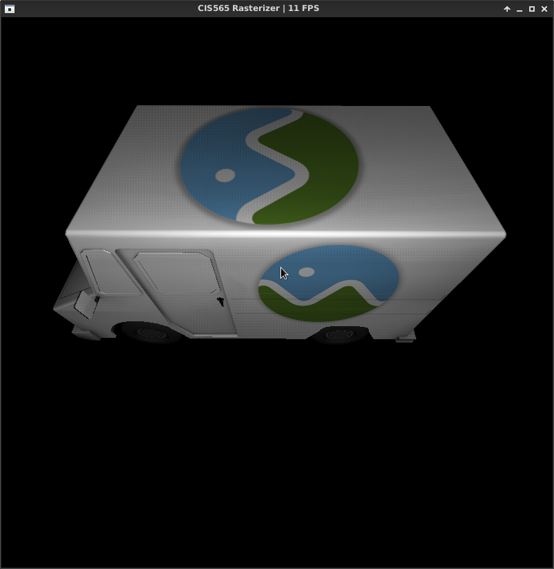
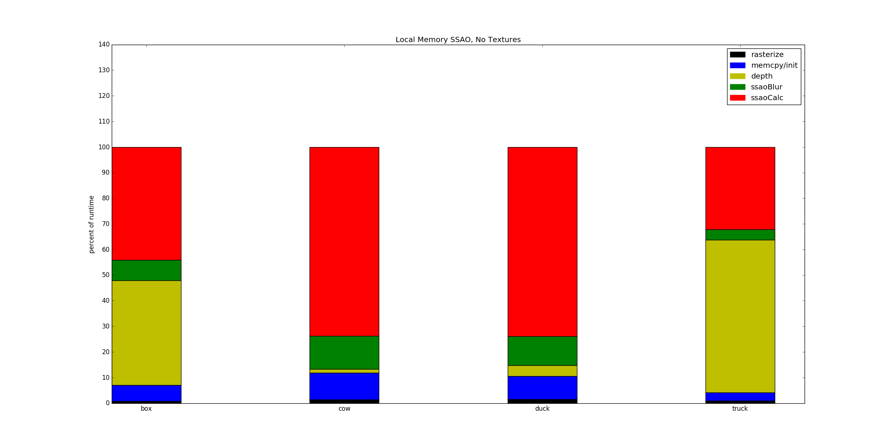
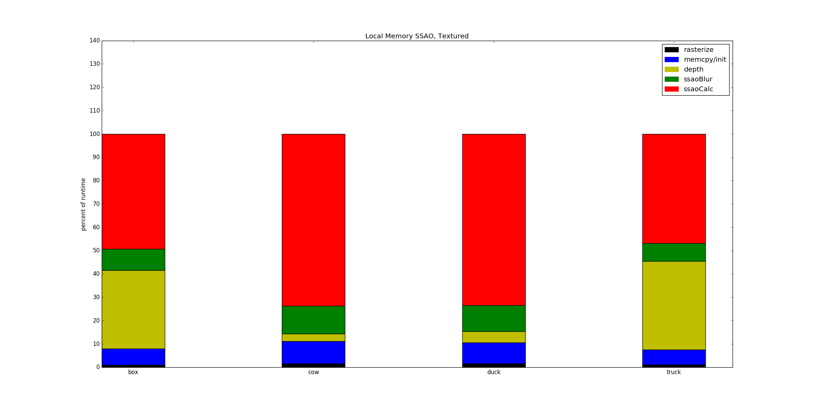

CUDA Rasterization Pipeline
======================

**University of Pennsylvania, CIS 565: GPU Programming and Architecture, Project 4**

* Daniel Krupka
* Tested on: Debian testing (stretch), Intel(R) Core(TM) i7-4710HQ CPU @ 2.50GHz 8GB, GTX 850M

# About
This is a CUDA rasterization pipeline made for UPenn's CIS565. It features
* GLTF model loading
* Perspective correct diffuse PNG textures
* Screen space ambient occlusion (SSAO)
The pipeline utilizes deferred shading - the `depthPass` kernel performs depth testing and
assembles the G-buffer prior to shading and SSAO.

# Screenshots
Video of the rasterizer in action can be found [here](https://youtu.be/_Y-9eAgICrI).

# Textures
I implemented perspective-correct UV texturing for diffuse coloring, using CUDA's texture memory functionality.

# SSAO
I also implemented SSAO, both using shared memory and without.

# Performance

The textureless pipeline was substantially faster for the models with textures (duck, milk truck), particulary when omitting the truck's
fairly large texture, due to having far fewer memory accesses. However, the small textureless models did experience a small slowdown, possibly due to having
fewer calculations to mask latency, as barycentric texture coordinate interpolation was skipped. This could be fairly easily extended to include textures for
bump mapping, specular shading, etc.

For SSAO, shared memory did make a small improvement in all cases, but particularly the cow and duck, which both possessed large overhangs. The `ssaoBlur` kernel
could have used shared memory as well, but the handling for cross-block contributions was necessary somewhat complicated. Depth testing could also benefit, but
would require a tiling scheme, also introducing more complication.

