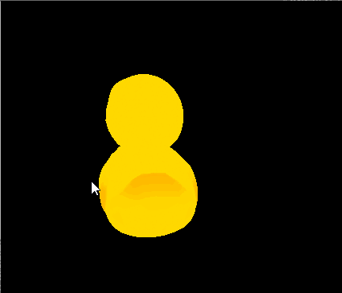
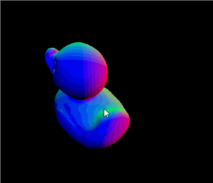
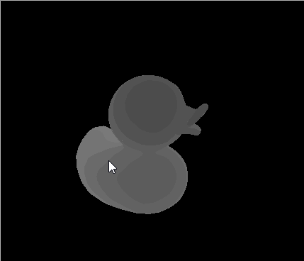
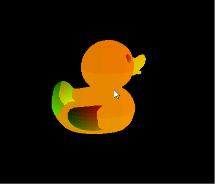
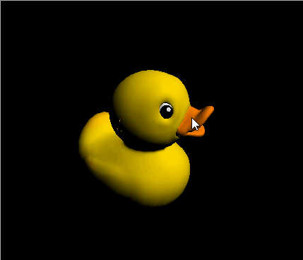

CUDA Rasterizer
===============

[CLICK ME FOR INSTRUCTION OF THIS PROJECT](./INSTRUCTION.md)

**University of Pennsylvania, CIS 565: GPU Programming and Architecture, Project 4**

* Liang Peng
* Tested on: Windows 10, i7-6700HQ @ 2.6GHz 2.6GHz 8GB, GTX 960M (Personal Laptop)

## Features
* [ ] Primitive
	* [ ] Point
	* [ ] Line
	* [x] Triangle
* [ ] Texture
	* [x] Diffuse
	* [ ] Normal Map
* [ ] Lighting
	* [x] Lambert
	* [ ] Blinn
* [x] Normal Visualization
* [x] Depth Visualization

## Overview

Texture | Normal | Depth | Texcoord
--- | --- | --- | ---
 |  |  | 

Lambert | Blinn
--- | ---
  |  

### Credits

* [tinygltfloader](https://github.com/syoyo/tinygltfloader) by [@soyoyo](https://github.com/syoyo)
* [glTF Sample Models](https://github.com/KhronosGroup/glTF/blob/master/sampleModels/README.md)
