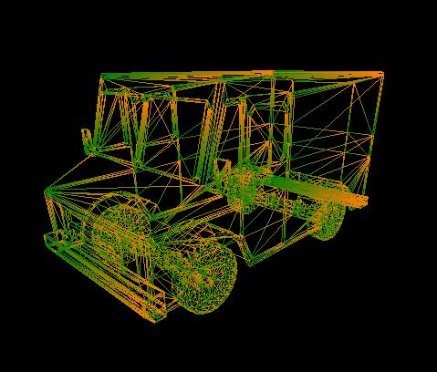
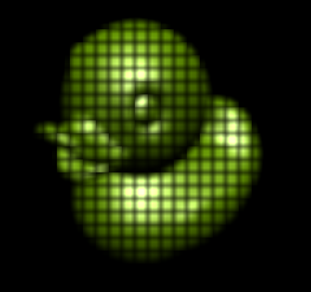

CUDA Rasterizer
===============

**University of Pennsylvania, CIS 565: GPU Programming and Architecture, Project 4**

* Ottavio Hartman
* Tested on: Windows 10, AMD Fx-8320 @ 3.50GHz 8GB, GTX 1060 3GB (Personal Desktop)

### About
I have implemented an efficient CUDA rasterizer with Blinn-Phong shading, support for triangles, lines, and points, and an efficient blur using shared memory. The basic overview of the pipeline I used is as follows: 

1. Transform vertices from world space to screen space
2. Assemble vertices into triangles using indices
3. Rasterize--parallelize over primitives and in the kernel loop over the pixels in the bounding box of the primitive. Hit test each pixel with the primitive and create a fragment with `color`, `eyeNor`, and `eyePos` for use in the fragment shader. In this stage I also used an integer buffer to act as a mutex for writing and reading to the depth buffer (which is an array of integers scaled as distances from the camera). This allows for accurate depth testing because the fragment needs the mutex lock in order to read to and write from the depth buffer.
4. Fragment shader--this is where the blur shader is implemented. The naive blur shader reads surrounding pixels (11x11 grid of neighbors) from global memory. The analysis of the performance benefit of using shared memory is in the __Performance__ section.

Without bounding box
Cow - 318 - 330 ms per frame

With bb
1.18 ms Max--largest triangles on screen -- per frame
Measured using cuda events

Side note: random speckles in image were caused by depth testing/lock issue.
Using a mutex array solved it.

### Shading
Blinn-phong used from https://en.wikipedia.org/wiki/Blinn%E2%80%93Phong_shading_model

### Blur
72-72 ms per frame - 21x21 - 8x8 blocks
60-61 ms per frame - 21x21 - 16x16 blocks
16x16 shared memory 

Without framebuffer[index] +=.... 14ms per frame
With shared memory...13ms per frame -- WRONG (bug in code)

420 global accesses, 21 shared.... (for one random pixel)
- 21x21 blur is bigger than blocks, so very little shared memory used

11x11 blur
- 4.23 - 4.25ms

### Performance/Optimizations

### Credits

* [tinygltfloader](https://github.com/syoyo/tinygltfloader) by [@soyoyo](https://github.com/syoyo)
* [glTF Sample Models](https://github.com/KhronosGroup/glTF/blob/master/sampleModels/README.md)
A brief description of the project and the specific features you implemented.
At least one screenshot of your project running.
A 30 second or longer video of your project running.
A performance analysis (described below).