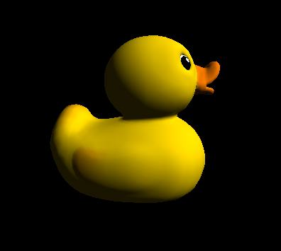
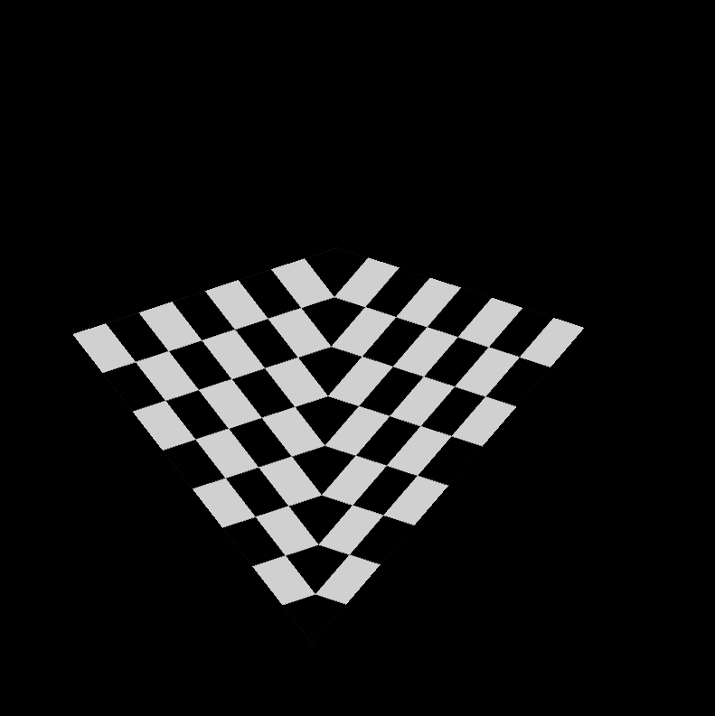
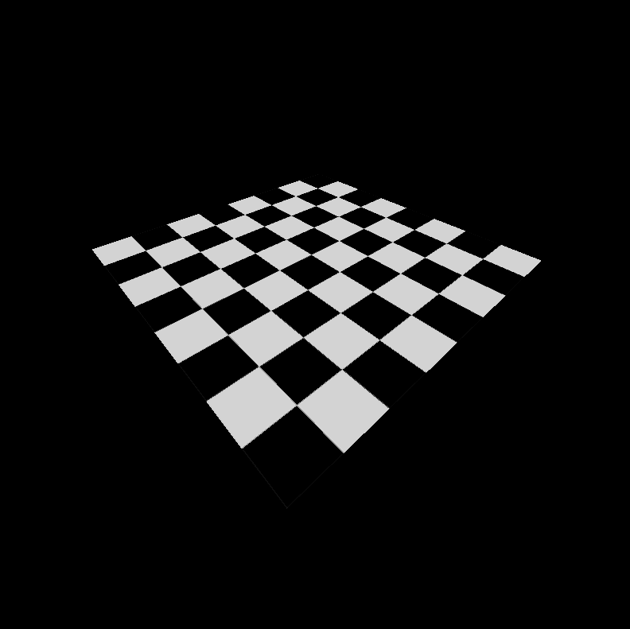
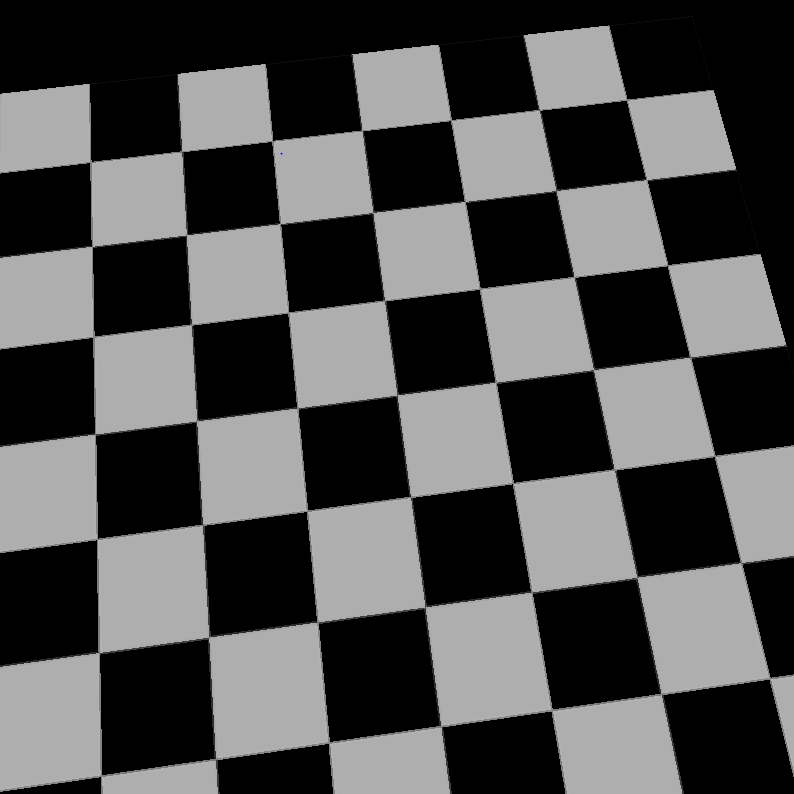
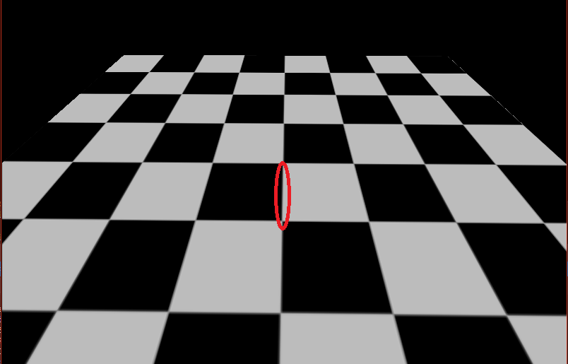

CUDA Rasterizer
===============
**University of Pennsylvania, CIS 565: GPU Programming and Architecture, Project 4**

 * David Liao
 * Tested on: Tested on: Windows 7 Professional, Intel(R) Xeon(R) CPU E5-1630 v4 @ 3.70 GHz 3.70 GHz, GTX 1070 8192MB (SIG Lab)

### Rasterizer
A rasterizer takes a scene described in 3d space and maps it to a 2d space for output to a screen. It differs from a ray tracing in that no rays are fired from the camera to intersect with geometry. Rather the geometry (usually composed of triangles) has its vertices projected onto a screen with perspective correct transformations and then shaded in appropriately. A depth buffer (or z-buffer) is used to keep track of which triangles are on top of others. The above gif demonstrates the basic properties of a rasterizer.

### Main Features
 * Basic rasterizer implementation
 * Lambert Shading
 * Texture mapping with perspective correct tranformation and bilinear interpolation
 * Backface culling with stream compaction
 * NPR shading (Oil painting)

### Pipeline
 * Buffer initialization
 * Vertex Shading
 * Primitive assembly
 * Rasterization
 * Texture loading
 * NPR Shading
 * Fragment Light Shading
 * Framebuffer writing

### Texture Mapping
#### UV Mapping
The rasterizer transforms the 2d space into uv texture space and reads from the loaded textures to determine fragment color.

#### Perspective Correct Transformation
If we naively interpolate the texture coordinates by using the barycentric weights, we'll end up with a distortion unless we take into account our perspective. The below effect demonstrates the affine (left) vs perspective correct transformations (right). 

#### Bilinear Interpolation
Sometimes sampling the textures leaves us with rough-edged textures (left). As a result, we sample adjacent textures and interpolate the texture color (right). As a result, we introduce a bit of blurriness and take a hit in performance but remove jarring edges.

### Backface Culling

### Non-Photorealistic Rendering

### Credits

* [tinygltfloader](https://github.com/syoyo/tinygltfloader) by [@soyoyo](https://github.com/syoyo)
* [glTF Sample Models](https://github.com/KhronosGroup/glTF/blob/master/sampleModels/README.md)
