CUDA Rasterizer
===============

**University of Pennsylvania, CIS 565: GPU Programming and Architecture, Project 4**

* Name: Zhan Xiong Chin
* Tested on: Windows 7 Professional, Intel(R) Xeon(R) CPU E5-1630 v4 @ 3.70 GHz 3.70 GHz, GTX 1070 8192MB (SIG Lab)

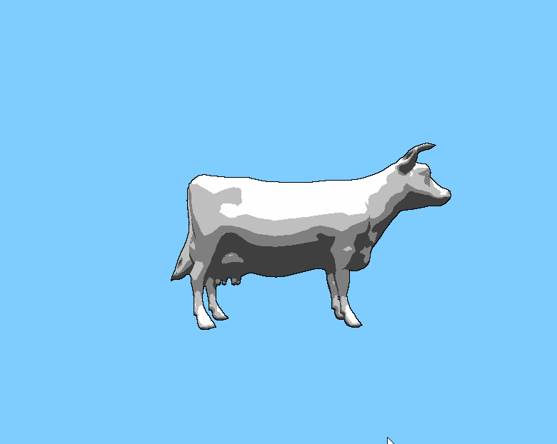

## Overview

GPU-based rasterizer. Features:

* Basic rendering of .gltf models
* UV texture mapping, with bilinear filtering and perspective correct texture coordinates
* Lambert shading
* Backface culling
* Toon shading

## Overview of pipeline

The rasterization pipeline consists of the following steps:

* Vertex shading
	* Transforms world coordinates into window space coordinates
* Primitive assembly
	* Creates triangles from vertices
* Backface culling
	* Culls backward-facing triangles
* Rasterization
	* For each triangle, calculates which pixels on screen it hits
	* Uses bounding-box to speed up above calculation
	* Do depth test to see if fragment is the closest to camera
	* Calculate texture coordinates, etc. of point using barycentric coordinates
	* Uses perspective correct texture coordinates 
* Texture mapping
	* Calculates color from texture coordinates
	* Uses bilinear filtering to smooth out low-res textures
* Edge detection (toon shading only)
	* Uses Sobel filter to find edges
	* Optimized using shared memory
* Fragment shading
	* Calculates color of each pixel using Lambert shading
	* Quantizes colors (toon shading only)
	* Uses results of Sobel filter to darken edges (toon shading only)

## Performance overview

Some render timings are given below, broken down by time spent in each stage of the pipeline. Rasterization tends to take the longest to complete, most likely because of the complex calculations as well as the locking required to do the depth test. There are some models where this is a serious problem, such as the Cesium milk truck render, where the rasterizer alone takes 200000 microseconds to complete, even when all other kernels have similar timings to the ones listed below. The models used for the below timings are shown in the introduction.

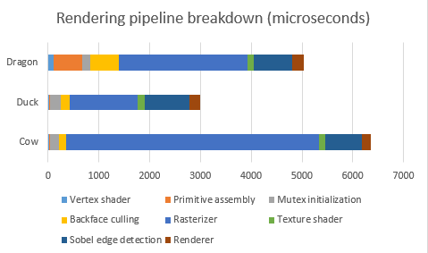

## Features

### Backface culling

Backface culling was used (with thrust's remove_if) to reduce the number of triangles needed to render a model. For the Stanford dragon (shown below in toon shading), backface culling reduced the number of triangles from 100000 to 45704, speeding up the rendering as shown below. 

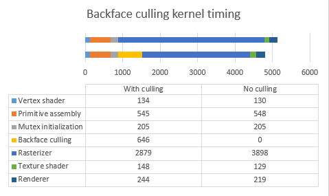

### Texture mapping

Texture mapping has two tweaks to the basic algorithm, bilinear interpolation and perspective correctness.

For perspective correctness, the texture coordinates are adjusted according to the depths of the fragments. The importance of this correction can be seen in the below chessboard renders. The above has the correction applied, whereas the second does not.

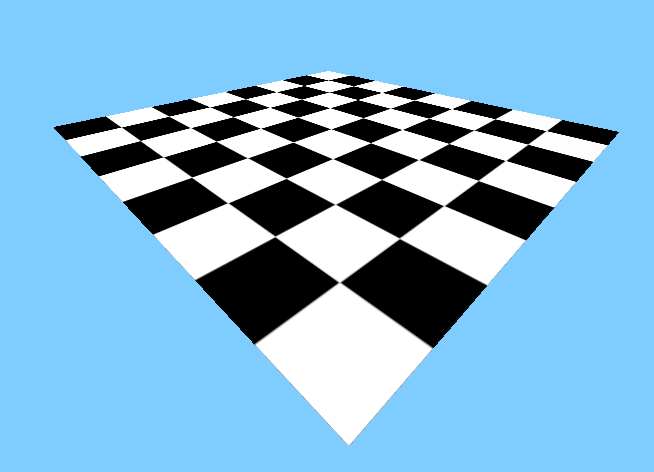

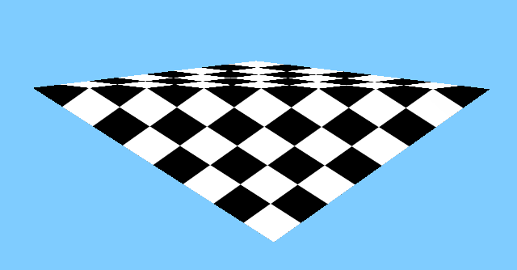

Bilinear filtering is also applied to smooth out textures, by interpolating between the 4 pixels from the texture a fragment borders. This results in a smoother texture, as can be seen below. Bilinear filtering is applied to the left texture, but not the right one.

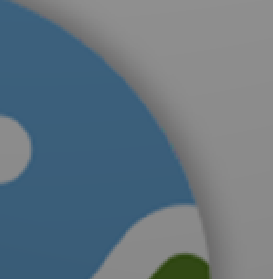

Both perspective correctness and bilinear filtering complicate the texture mapping code, slowing down the texture mapping kernel by about 50% when rendering the image shown in the introduction. However, this kernel is not a significant percentage of the code, so this slowdown is negligible overall.

### Toon shading

Toon shading consists of two steps: color quantization and edge detection. 

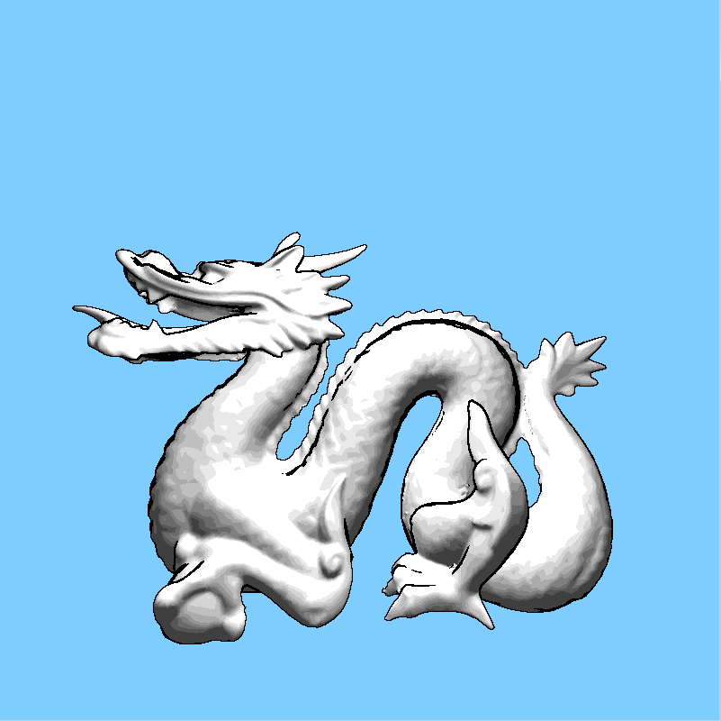

_Stanford dragon, toon shading with borders_

Color quantization creates a small number of discrete shades, causing a "flat" look rather than a smooth gradient of colors.

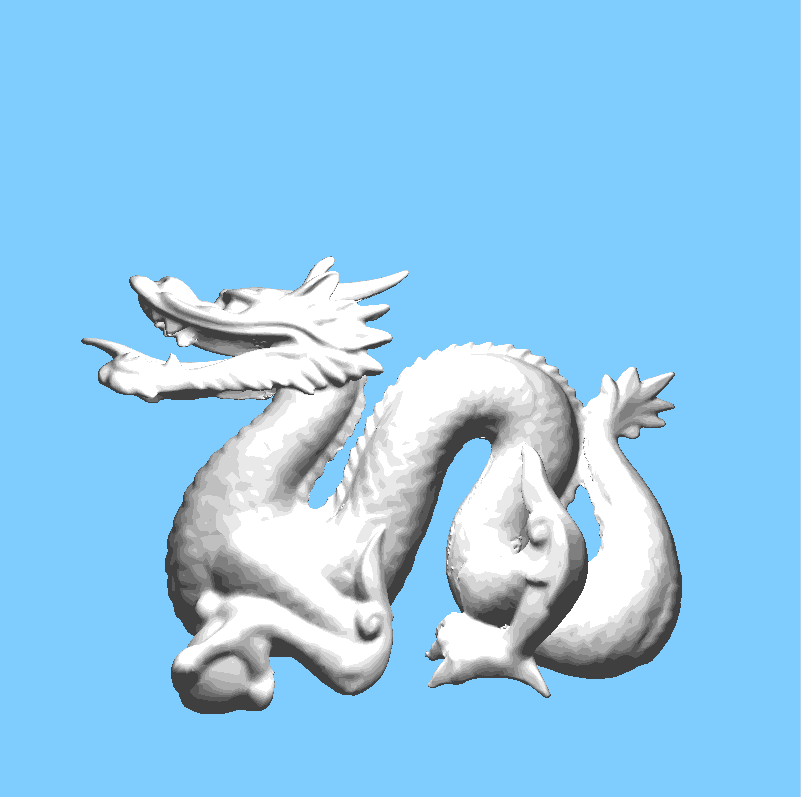

_Stanford dragon, toon shading (no borders)_

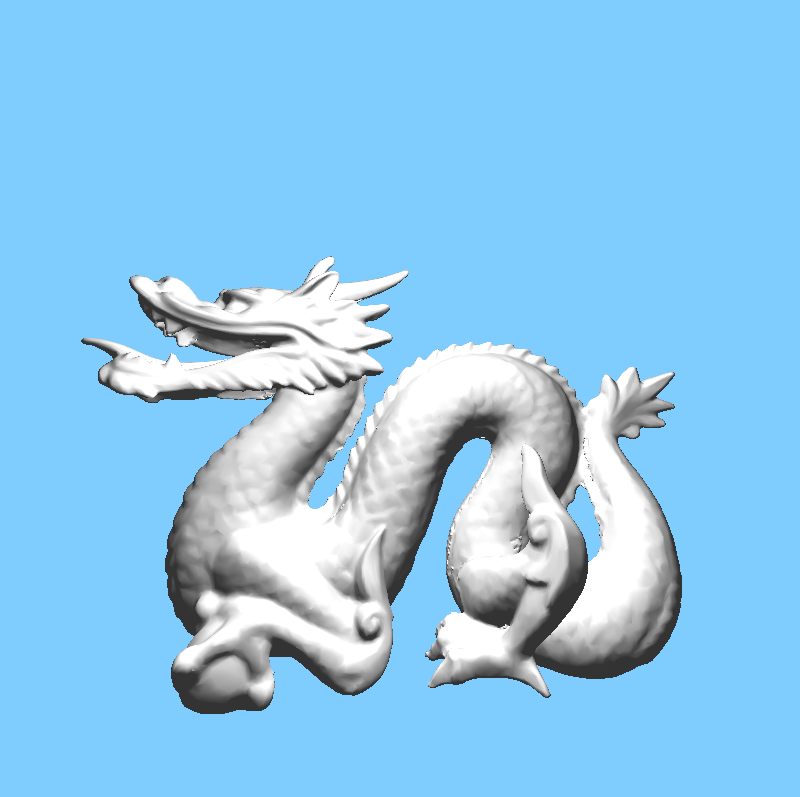

_Stanford dragon, Lambert shading. Note the smooth coloring on the scales compared to the "blotchy" toon shading_

Then, edge detection is performed using a [Sobel filter](https://en.wikipedia.org/wiki/Sobel_operator), and all edges are rendered black.

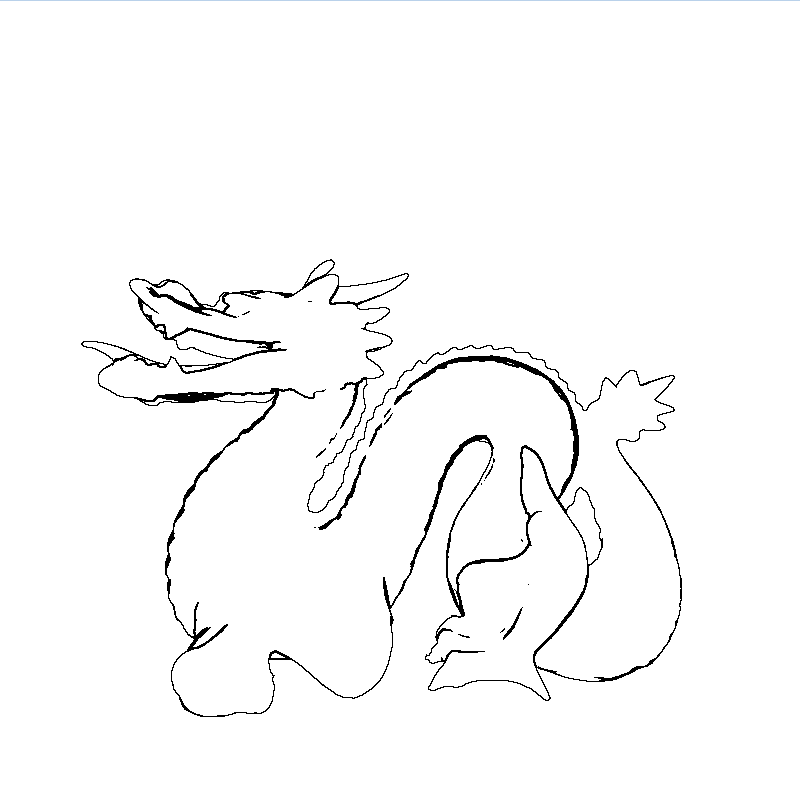

_Stanford dragon, Sobel filter outline_

The two are combined at the end to achieve the "toon" effect.

The toon shader does decrease performance, especially since an additional kernel needs to be executed for the Sobel filter, which comprises approximately 25% of the rendering time. To optimize this, a version of the Sobel filter was written that calculated the convolution in a grid pattern using shared memory. This halved the time required for the Sobel filter step from about 1.8 milliseconds to 0.9 milliseconds. 

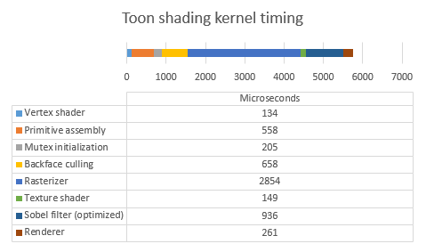