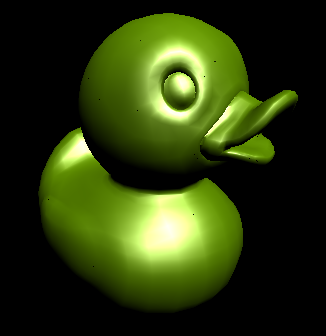

CUDA Rasterizer
===============

**University of Pennsylvania, CIS 565: GPU Programming and Architecture, Project 4**

* Ottavio Hartman
* Tested on: Windows 10, AMD Fx-8320 @ 3.50GHz 8GB, GTX 1060 3GB (Personal Desktop)

### Overview
I have implemented an efficient CUDA rasterizer with Blinn-Phong shading, support for triangles, lines, and points, and an efficient blur using shared memory. The basic overview of the pipeline I used is as follows: 

1. Transform vertices from world space to screen space
2. Assemble vertices into triangles using indices
3. Rasterize--parallelize over primitives and in the kernel loop over the pixels in the bounding box of the primitive. Hit test each pixel with the primitive and create a fragment with `color`, `eyeNor`, and `eyePos` for use in the fragment shader. In this stage I also used an integer buffer to act as a mutex for writing and reading to the depth buffer (which is an array of integers scaled as distances from the camera). This allows for accurate depth testing because the fragment needs the mutex lock in order to read to and write from the depth buffer.
4. Fragment shader--using the fragment information such as `eyeNor`, the fragment shader calculates lighting using Blinn-Phong shading.
5. Blur--the naive blur shader reads surrounding pixels (11x11 grid of neighbors) from global memory. Then, I used shared memory to speed up the read speed of threads in a block. The analysis of the performance benefit of using shared memory is in the __Performance__ section.

### Rasterization
Parallelizing over the primitives in the scene with their vertices in screen space (x,y coordinates on the screen), I first calculated their bounding box. Then, the kernel loops over pixels in a "scanline" fashion--that is, it starts at the upper left corner of the bounding box and hit-tests every pixel in a row before moving on to the next row. The hit-test uses barycentric coordinates of the pixel with regard to the primitive. This barycentric coordinate is useful because, if a hit is detected, the kernel uses the barycentric coordinate to interpolate the normal values of the triangle for the fragment. This information is used to make a smooth-looking lighting fragment shader.

Another step in the rasterization kernel is depth-testing. I used a mutex integer buffer, `dev_mutex`, which provides locks for the fragments so they can depth-test and possibly write to the `int` depth buffer without race conditions. 

This is an example of what the rasterization looks like without proper mutex locks to prevent race conditions when depth-testing. There are small black dots randomly spread out in the image which correspond to improperly depth-tested pixels--these pixels are actually the back-facing pixels on the other side of the duck.

#### Lines and Points
I additionally implemented line and point rendering. Point rasterization is very simple: for every vertex, simply "fill in" the corresponding pixel. Line rasterization required more effort since every pixel on the line needs to be touching its neighbors on the line. The method I used (which is roughly based on [MIT's Frédo Durand and Seth Teller's lectures](http://groups.csail.mit.edu/graphics/classes/6.837/F02/lectures/6.837-7_Line.pdf)), calculates the slope of the line first. There are two cases which I've implemented: if the slope of the line is less than or equal to 1, or if it is greater than 1. The reason for dividing into two cases is because line rasterization steps 1 pixel in the x or y direction and then steps some `float` distance in the opposite direction and fills in the pixel. The way to choose which "1 pixel" step the kernel should use is based on whether the line has a slope greater or less than 1. The main loop of the kernel steps pixel by pixel along the line and proceeds to color them in.

### Shading
The fragment shader uses the calculated normals from the previous steps to apply a properly-shaded Blinn-Phong model (Blinn-phong used from [here](https://en.wikipedia.org/wiki/Blinn%E2%80%93Phong_shading_model)). Unlike the rasterization step, the fragment shader is a kernel which runs on each pixel of the fragment buffer.
.

### Blur
I implemented a simple box blur to show how using shared memory can increase performance when sampling from nearby pixels in the frame buffer. Although box blur is very simple, the same method and performance increases with shared memory can be applied to bloom and gaussian blur, for example.

The box blur is a kernel which runs on every pixel and loops through all of its neighbors, calculating the average color and outputing it to a framebuffer. 

### Performance/Optimizations
While the rasterization pipeline is relatively simple to implement, making it efficient is harder and crucial to the rasterizer's performance.
#### Bounding boxes
The simplest improvement I made to the rasterizer is using bounding boxes to reduce the number of pixels the rasterizer kernel needs to search through to hit-test. The `cow` model, without bounding boxes, takes __318 - 330ms__ per frame. With bounding boxes, it improves to __1.18-1.22ms__ per frame. This massive improvement has to do with the fact 
Measured using cuda events

#### Shared Memory
72-72 ms per frame - 21x21 - 8x8 blocks
60-61 ms per frame - 21x21 - 16x16 blocks
16x16 shared memory 

Without framebuffer[index] +=.... 14ms per frame
With shared memory...

11x11 - global - 4.10ms
11x11 - shared - 3.15ms
23% improvement

21x21 - global - 14.2ms
21x21 - shared - 9.50ms
33% improvement

420 global accesses, 21 shared.... (for one random pixel)
- 21x21 blur is bigger than blocks, so very little shared memory used

#### Rasterization pipeline and bottlenecks

### Credits

* [tinygltfloader](https://github.com/syoyo/tinygltfloader) by [@soyoyo](https://github.com/syoyo)
* [glTF Sample Models](https://github.com/KhronosGroup/glTF/blob/master/sampleModels/README.md)
A brief description of the project and the specific features you implemented.
At least one screenshot of your project running.
A 30 second or longer video of your project running.
A performance analysis (described below).