CUDA Rasterizer
===============

[CLICK ME FOR INSTRUCTION OF THIS PROJECT](./INSTRUCTION.md)

**University of Pennsylvania, CIS 565: GPU Programming and Architecture, Project 4**

* Liang Peng
* Tested on: Windows 10, i7-6700HQ @ 2.6GHz 2.6GHz 8GB, GTX 960M (Personal Laptop)

## Features
* [x] Primitive
	* [x] Point
	* [x] Line
	* [x] Triangle
* [x] Texture
	* [x] Diffuse
	* [x] Bilinear Filtering
* [x] Lighting
	* [x] Lambert
	* [x] Blinn-Phong
* [x] Normal Visualization
* [x] Depth Visualization
* [x] Depth Test with Mutex
* [x] Perspective Corrected Texcoord
* [x] Performance Analysis

## Overview
### Basic Attributes
Texture | Normal | Depth | Texcoord
--- | --- | --- | ---
 |  |  | 
_Note*_ Attributes displayed on each pixel are calculated by several steps. Vertex Shader processes each vertex by transforming vertex positions from model space to view space then to projection space, calculating eye positions, eye normals, texcoords. Next Primitive assembler will group all vertices in primitives, in this project, triangles. Then rasterizer will proccess every triangle by testing every pixel in its bounding box. If a pixel is on the triangle, its position, normal, texcoord are interpolated using barycentric weights on the threes vertices, and stored in fragment buffer. Last Fragment Shader will calculate color to shade each pixel using these attributes and store the color in frame buffer.

### Lighting
Lambert | Blinn-Phong
--- | ---
  | 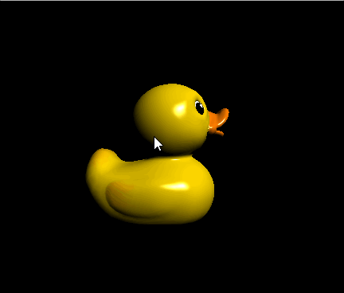
_Note*_ Lighting is calculated in Fragment Shader for each pixel. Lambert reflectance is proportional to the dot product of surface normal and light direction, while Blinn-Phong reflectance is proportional to the dot product of surface normal and halfway direction raised to the power of shininess.

### Resterization Mode
Point Cloud | Wireframe | Solid
--- | --- | ---
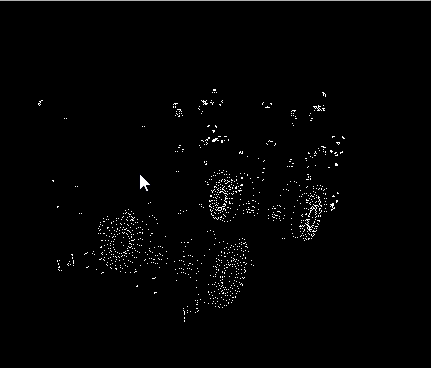 | 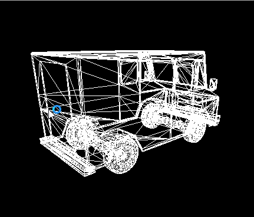 | 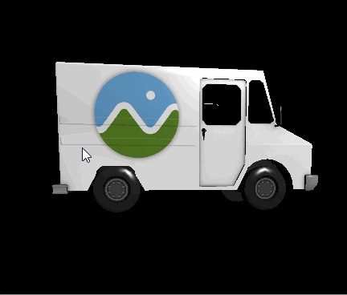
 _Note*_ Point Cloud mode is implemented in a straight forward way, by shading the pixel where each pixel is located. Wireframe mode is most concerned with how to shade the pixels between two vertices. In this project, I implemented that by enforcing one pixel in each row if a segment is more vertical than 45 degree, or one pixel in each column if the segment is more horizontal than 45 degree.

### Depth Test with Mutex
Mutex OFF | Mutex ON
--- | ---
63 ms/frame | 74 ms/frame
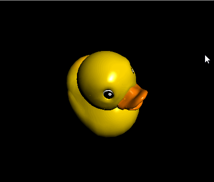 | 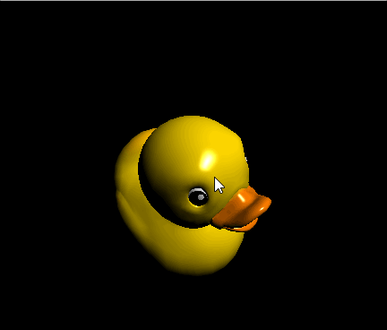
 _Note*_ We can see in the animated GIFs, noise appears in Mutex OFF mode, because of race condition. To avoid that, each pixel has its own mutex, which is essentially an unsigned integer. When a CUDA thread is trying to seize a pixel to write, it calls atomicCAS to try to change the value of mutex. If it succeeded, it can then safely write that pixel, or it would try again. It alse takes more time to process a frame with Mutex.

### Texcoord Correction
Perspective Correction OFF | Perspective Correction ON
--- | ---
 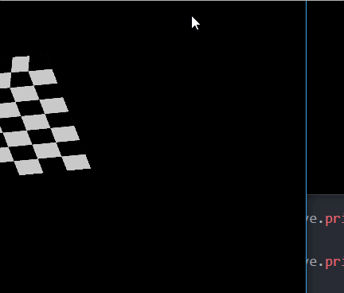 | 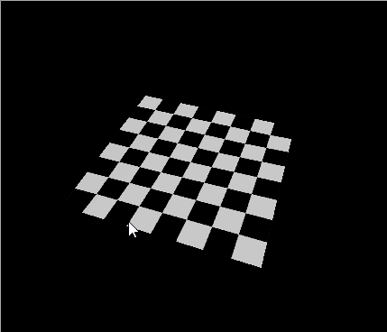
 _Note*_ Texcoord Correction is unconditionally necessary since texture mapping would look wrong without correction. This is due to the fact that texture coordinates are interpolated in screen space, ignoring the depth information (Texcoords with deeper depth would be denser).

### Texture Filtering
Nearest Neighbor | Bilinear
--- | ---
 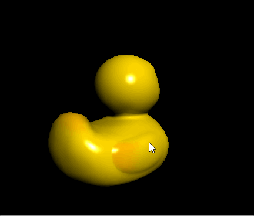 | 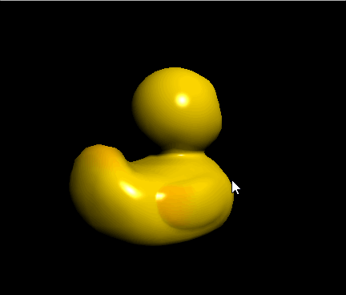
 _Note*_ Bilinear filtering is useful because texcoords are normalized thus cannot be mapped to a texel exactly after being scaled by texture width and height, thus we grab the four texels around the scaled texcoord and bilinear interpolate the color.

### Performance Analysis
* Resterization Mode

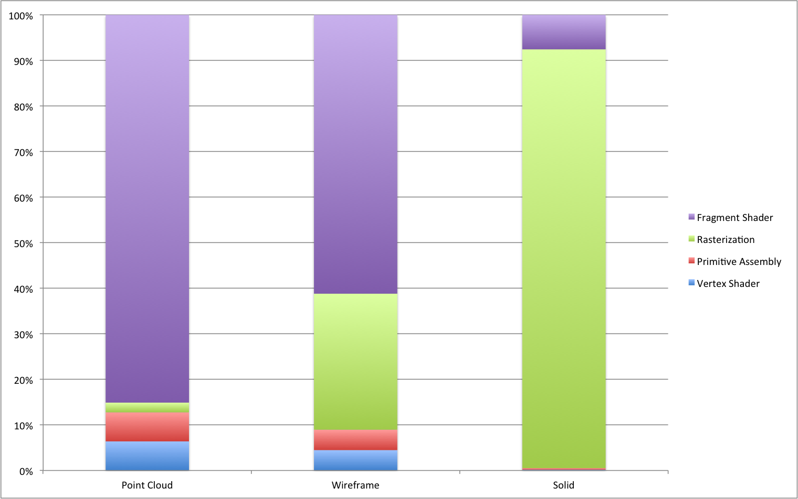

_Note*_ From the stacked column chart we can see that point cloud mode has the lowest percentage of rasterization runtime, while solid mode has the highest percentage. This is because in solid mode, every pixel within the bounding box of each triangle is tested, which makes rasterization of triangles computatino consuming.

* Different Models

Cow | Duck | Truck
--- | --- | ---
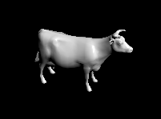 | 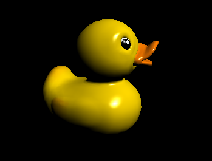 | 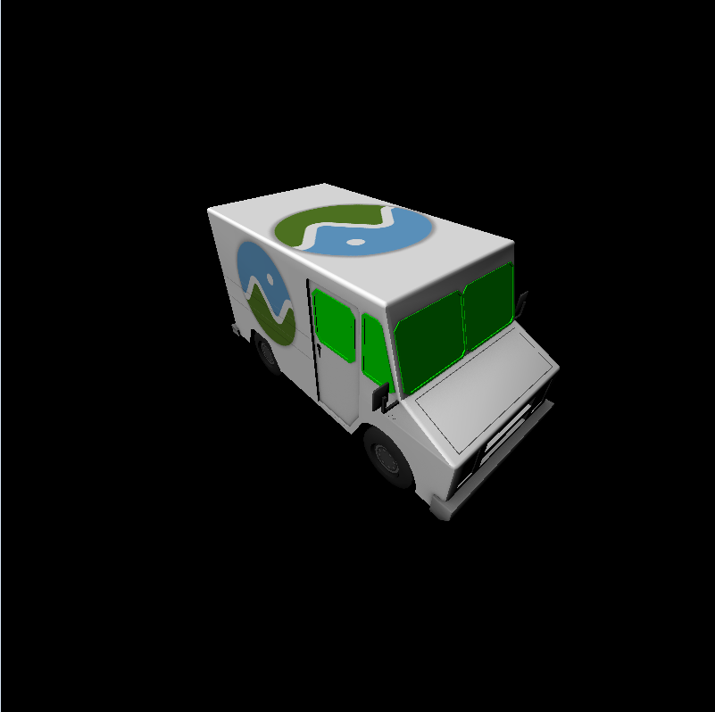

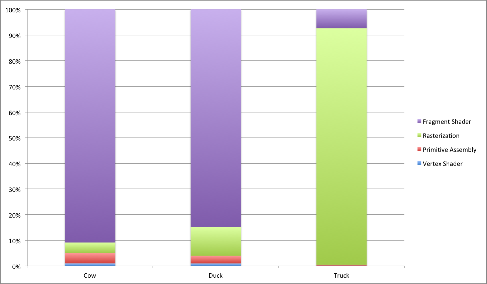

### Credits

* [tinygltfloader](https://github.com/syoyo/tinygltfloader) by [@soyoyo](https://github.com/syoyo)
* [glTF Sample Models](https://github.com/KhronosGroup/glTF/blob/master/sampleModels/README.md)
