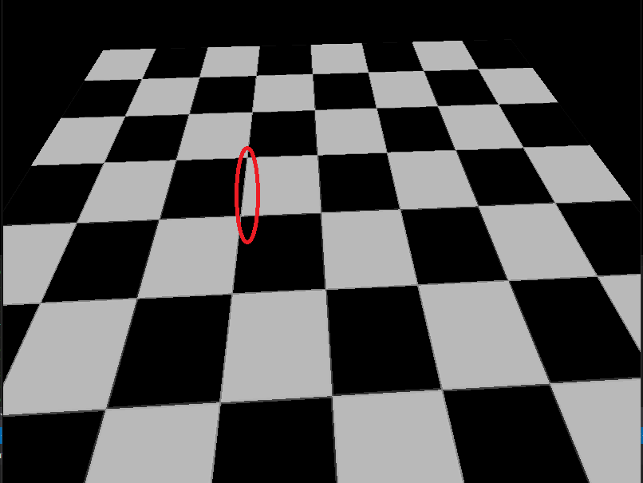
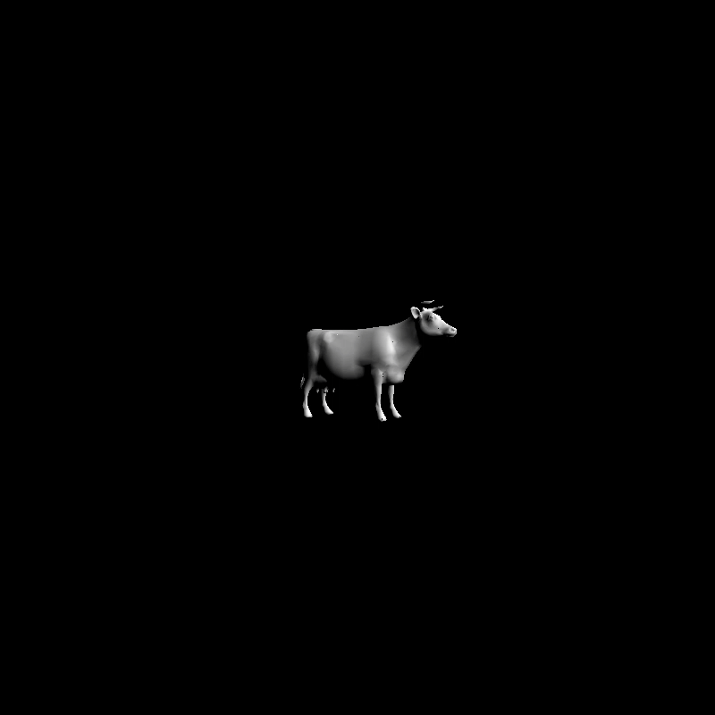
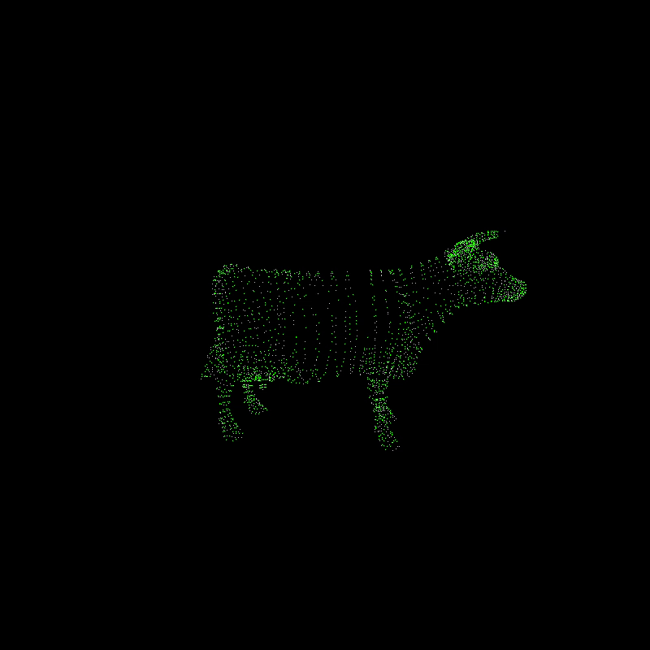

CUDA Rasterizer
===============

[CLICK ME FOR INSTRUCTION OF THIS PROJECT](./INSTRUCTION.md)

**University of Pennsylvania, CIS 565: GPU Programming and Architecture, Project 2**

* Akshay Shah
* Tested on: Windows 10, i7-5700HQ @ 2.70GHz 16GB, GTX 970M 6GB (Personal Computer)

### GPU Rasterizer

Renders:

Textures: with Bilinear Interpolation
-------------------------------------
| Without Bilinear Filtering  | With Bilinear Filtering |
| --------------------------  | ----------------------- |
| ||

And Perspective correct texture coords
--------------------------------------

| Without Perspective correct Texture | With Perspective correct Texture |
| ----------------------------------- | -------------------------------- |
|     |    |

Materials: Diffuse, Specular (Blinn-Phong), Toon Shading
--------------------------------------------------------

| Diffuse | Specular | Toon Shading |
| ------- | -------- | ------------ |
|  |  |  |
Different Primitives: Triangles (default), Lines (wireframe), Points
--------------------------------------------------------------------

| Triangles | Lines | Points |
| --------- | ----- | ------ |
|  |  |  |

### (TODO: Your README)

*DO NOT* leave the README to the last minute! It is a crucial part of the
project, and we will not be able to grade you without a good README.

### Credits

* [tinygltfloader](https://github.com/syoyo/tinygltfloader) by [@soyoyo](https://github.com/syoyo)
* [glTF Sample Models](https://github.com/KhronosGroup/glTF/blob/master/sampleModels/README.md)
