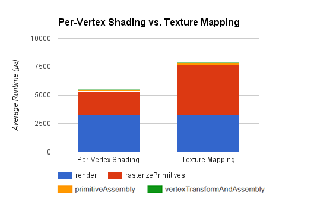
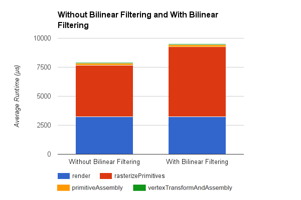
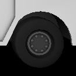
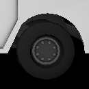
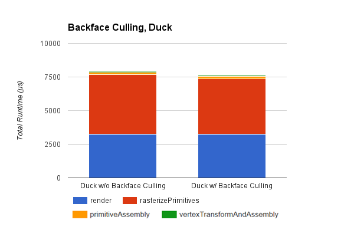
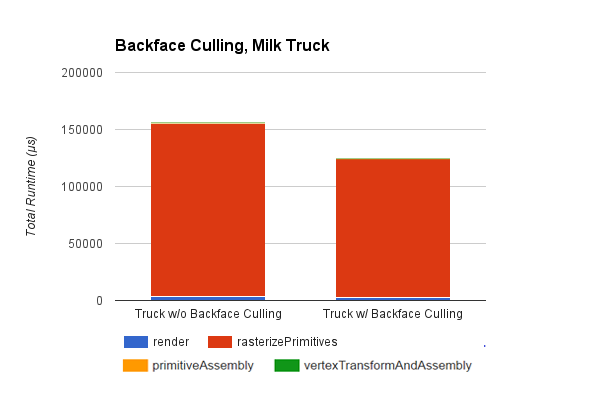

CUDA Rasterizer
===============

**University of Pennsylvania, CIS 565: GPU Programming and Architecture, Project 4**

* Richard Lee
* Tested on: Windows 7, i7-3720QM @ 2.60GHz 8GB, GT 650M 4GB (Personal Computer)

## Features

* Basic Rasterization Pipeline
* Per-Vertex Color Interpolation
* Backface Culling
* Texture Mapping with Bilinear Filtering and Perspective Correction

#### Basic Pipeline

The rasterizer implements the vertex shading, rasterization, and fragment shading stages of the graphics pipeline. It stores the glTF model as triangle primitives, which are rasterized and passed into the fragment shader buffer with a depth test before being shaded and rendered with a diffuse lighting scheme.

#### Per-Vertex Color and Texture Mapping

Both per-vertex color and texture mapping with perspective correction were implemented for the rasterizer. Performing a texture lookup for each fragment had a significant performance impact on the rasterization stage, which made sense because the per-vertex method was able to just perform a simple color interpolation between the vertices. However, there is also a significant improvement in quality, as seen in the comparison below. With large triangles containing a lot of texture information, such as the milk truck model, texture mapping must be used in order to obtain a sufficient amount of detail.

 

#### Bilinear Filtering

Bilinear texture filtering was also implemented for the texture mapping stage, by performing a horizontal and vertical linear interpolation on the UV coordinate. This had a small performance impact due to the additional texture lookups, but removed some aliasing on the textures.

 

#### Backface Culling

Backface culling was implemented with stream compaction by removing any primitives before the rasterization stage which were facing away from the camera. This had a negligible effect on smaller models like the duck, but had a more noticeable improvement during the rasterization on larger models like the truck due to the reduced primitive pool. In addition, this stage removed any unenclosed faces which were facing away from the camera, as seen below.

 

 

### Credits

* [tinygltfloader](https://github.com/syoyo/tinygltfloader) by [@soyoyo](https://github.com/syoyo)
* [glTF Sample Models](https://github.com/KhronosGroup/glTF/blob/master/sampleModels/README.md)
