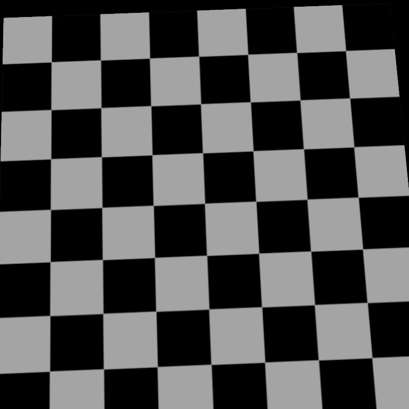
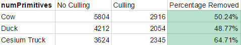
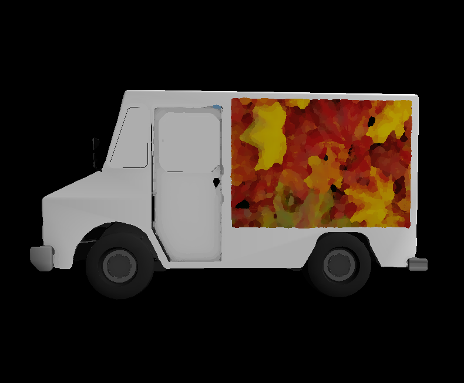

CUDA Rasterizer
===============
**University of Pennsylvania, CIS 565: GPU Programming and Architecture, Project 4**

 * David Liao
 * Tested on: Tested on: Windows 7 Professional, Intel(R) Xeon(R) CPU E5-1630 v4 @ 3.70 GHz 3.70 GHz, GTX 1070 8192MB (SIG Lab)

### Rasterizer
A rasterizer takes a scene described in 3d space and maps it to a 2d space for output to a screen. It differs from a ray tracing in that no rays are fired from the camera to intersect with geometry. Rather the geometry (usually composed of triangles) has its vertices projected onto a screen with perspective correct transformations and then shaded in appropriately. A depth buffer (or z-buffer) is used to keep track of which triangles are on top of others. The above gif demonstrates the basic properties of a rasterizer.

### Main Features
 * Basic rasterizer implementation
 * Lambert Shading
 * Texture mapping with perspective correct tranformation and bilinear interpolation
 * Backface culling with stream compaction
 * NPR shading (Oil painting)

### Pipeline
 * Buffer initialization
 * Vertex Shading
 * Primitive assembly
 * Rasterization
 * Texture loading
 * NPR Shading
 * Fragment Light Shading
 * Framebuffer writing

### Texture Mapping
#### UV Mapping
The rasterizer transforms the 2d space into uv texture space and reads from the loaded textures to determine fragment color.

#### Perspective Correct Transformation
If we naively interpolate the texture coordinates by using the barycentric weights, we'll end up with a distortion unless we take into account our perspective. The below effect demonstrates the affine (left) vs perspective correct transformations (right). 

#### Bilinear Interpolation
Sometimes sampling the textures leaves us with rough-edged textures (left). As a result, we sample adjacent textures and interpolate the texture color (right). As a result, we introduce a bit of blurriness and take a hit in performance but remove jarring edges.

### Backface Culling
Backface culling involves a preprocessing step that determines whether a triangle is visible in the perspective of the viewer. This is determined by the chirality of the triangle primitives. If they are counter-clockwise when a front-facing triangle should be clockwise, then we can ignore that triangle. We also perform a stream compaction to ensure that all primitives that are culled are not accounted for in our kernel launches. Furthermore, depending on the perspective of the camera, more or less polygons will be culled. Below demonstrates the percentage of culled primitives from a side-view perspective (default perspective when launched). It was hard to determine the exact performance impact in terms of frames per second due to the strong processing capabilities of a 1070 card (everything was maxing out at 60 frames!). My hypothesis would be that the impact would be a linear improvement with respect to the culled primitives.

### Non-Photorealistic Rendering (NPR)
Before the final step in calculating the lighting of each fragment, we manipulate our fragment buffer by applying a NPR filter over it. In our case, we apply an oil painting effect onto our rasterized image. For each pixel, we search in a radius around it and cache all color intensities (determined by avg RGB value from 0-255). By caching all color intensities, we map them to the sum of all nearby RGB values of each intensity band. We then select the mode intensity and average all RGB values and set that pixel to the averaged RGB value. The parameters INTENSITY controls the blockyness of the filter and the RADIUS tunes the size of the "brush". The current settings for the pictures below are set to a radius of 4 and intensity of 25. We also vandalized the Cesium car a bit to demo the effect a bit better :).

### Performance Analysis

### Credits

* [tinygltfloader](https://github.com/syoyo/tinygltfloader) by [@soyoyo](https://github.com/syoyo)
* [glTF Sample Models](https://github.com/KhronosGroup/glTF/blob/master/sampleModels/README.md)
* [NPR Oil Painting Effect](http://www.codeproject.com/Articles/471994/OilPaintEffect)
