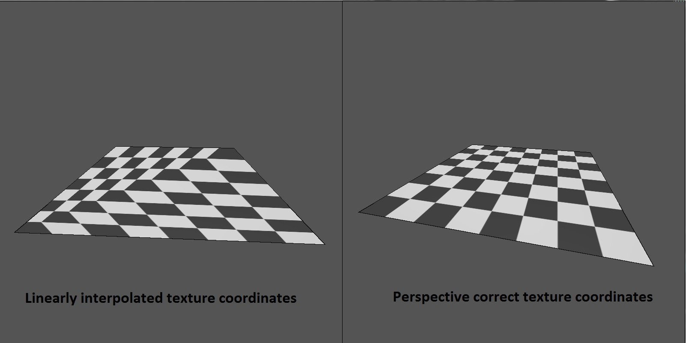
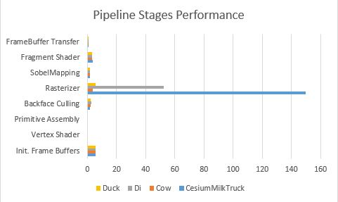
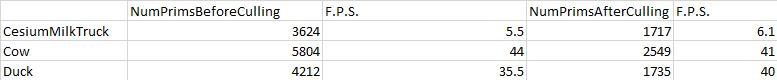
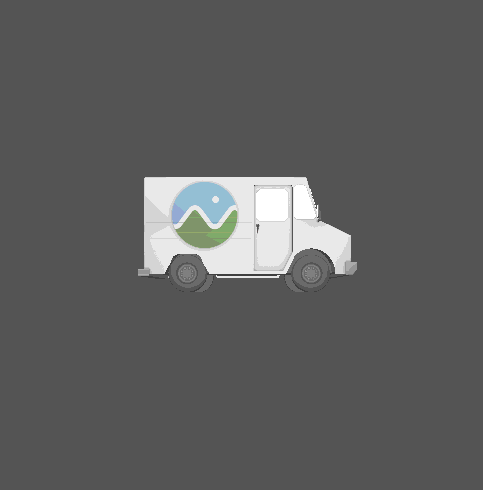

# University of Pennsylvania, CIS 565: GPU Programming and Architecture.
Project 4: CUDA Rasterizer
===============

## User resources
- **Name:** David Grosman.
- **Tested on:** Microsoft Windows 7 Professional, i7-5600U @ 2.6GHz, 256GB, GeForce 840M (Personal laptop).
- **Linked Project with:** "cudadevrt.lib".
Note: You must include "C:\Program Files\NVIDIA GPU Computing Toolkit\CUDA\v8.0\lib\x64\cudadevrt.lib;" in your Project Properties' Linker Input's Additional Dependencies field to get the Project running. This is because I am using thrust::remove_if() for my back-face culling phase.

### Preview

## Project description
This Project's purpose was to gain some experience with writing Graphics code that would benefit as much as possible from CUDA as possible. In fact, a rasterized graphics pipeline, similar to the OpenGL pipeline can be processed by custom kernels handling each primitives, vertices and fragments per kernel.
In this project, I have implemented the following features/pipeline stages:

* Vertex shading. (`_vertexTransformAndAssembly` in `rasterize.cu`)
* Primitive assembly with support for triangles read from buffers of index and
  vertex data. (`_primitiveAssembly` in `rasterize.cu`)
* Rasterization. (`_rasterize` in `rasterize.cu`)
* Fragment shading. Using Blinn-Phong with ambient, diffuse and specular light effects. (`render` in `rasterize.cu`)
* A depth buffer to store and depth test fragments.
* Fragment-to-depth-buffer writing (**with** atomics for race avoidance).
* Toon Shading by Post processing the fragment buffer divided into "tiles".
* Backface culling, optimized using thrust's stream compaction.
* UV texture mapping with bilinear texture filtering and perspective correct texture coordinates.
* Support for rasterizing additional primitives:
   * Lines or line strips (Press `W` to toggle between model drawing and wireframe mode).
   * Points (Press `P` to toggle between model drawing and point-cloud mode).

### My Pipeline

### Performance Analysis

### Postview

### Credits

* [tinygltfloader](https://github.com/syoyo/tinygltfloader) by [@soyoyo](https://github.com/syoyo)
* [glTF Sample Models](https://github.com/KhronosGroup/glTF/blob/master/sampleModels/README.md)
* [Bresenham Line Drawing Algorithm](http://groups.csail.mit.edu/graphics/classes/6.837/F99/grading/asst2/turnin/rdror/Bresenham.java): Source-code which I placed in my Code directly. Note that I implemented line and more advanced scanning algorithms in my undergraduate studies but couldn't find my code...
* [Sobel Kernel] (https://blog.saush.com/2011/04/20/edge-detection-with-the-sobel-operator-in-ruby/): Useful materials for understanding the concepts behind sobel kernels.
