CUDA Rasterizer
===============

**University of Pennsylvania, CIS 565: GPU Programming and Architecture, Project 4** 

* Xiang Deng
* Tested on:  Windows 10-Home, i7-6700U @ 2.6GHz 16GB, GTX 1060 6GB (Personal Computer)

* Overview
In this project we use CUDA to implement the raterizerized graphics pipeline. Major features
include vertex shading, primitive assembly, raterization and fragment shading. Here is a list of features:

**Features:**

* Basic pipeline
  * Vertex assembly and vertex shader
  * Primitive assembly
  * Rasterization
  * Depth test
  * Fragment shader (with lambert lighting)
  * Fragment-to-depth-buffer writing (with atomics for race avoidance).
  * A depth buffer for storing and depth testing fragments. 
* UV texture mapping with bilinear texture filtering and perspective correct texture coordinates
* Support for rasterizing additional primitives: lines and points

Milk truck | Duck
:-------------------------:|:-------------------------: 
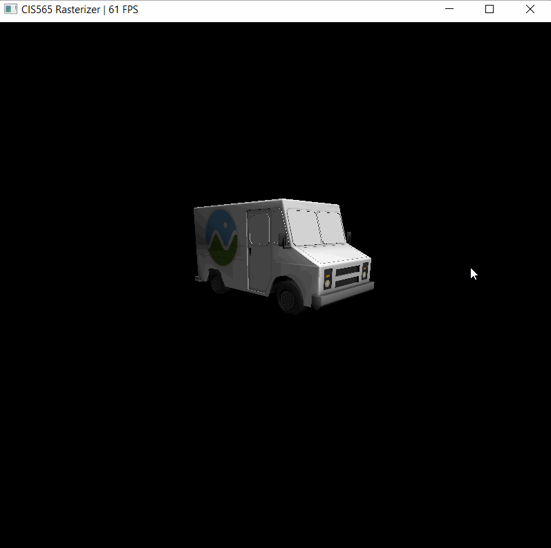 | 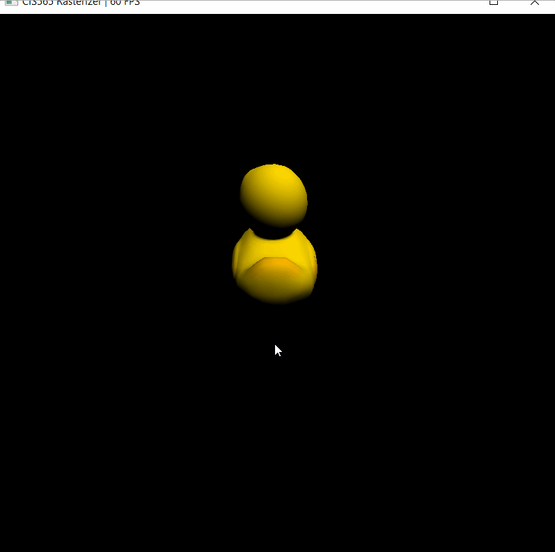 

Demo of basic raterization pipeline, we used lambert lighting for the fragement shader.

VC
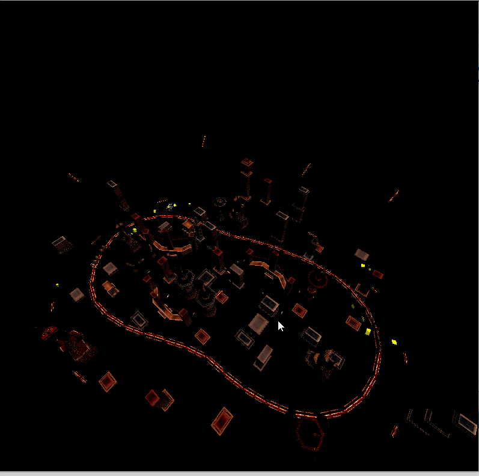

Cow with Lines | VC with Lines |Truck with Lines 
:-------------------------:|:-------------------------:  |:-------------------------:
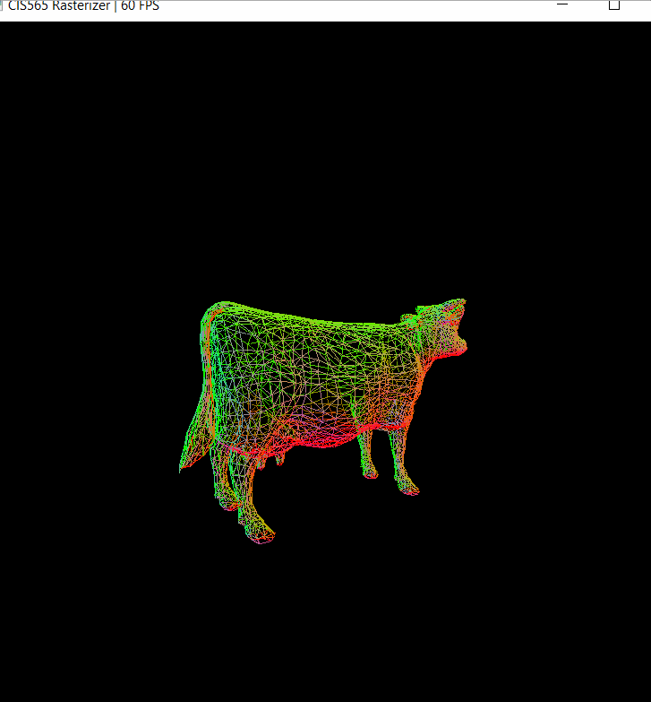 |  |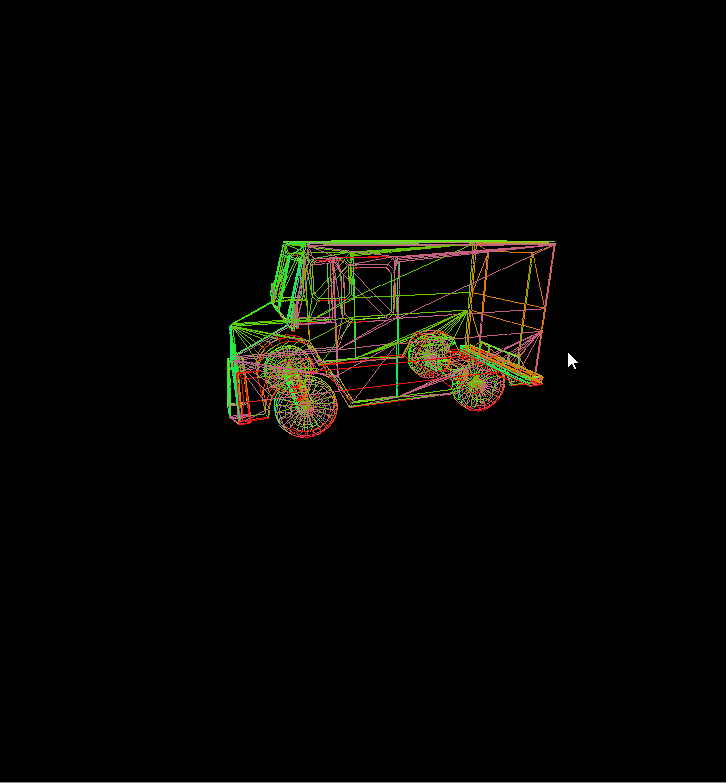

Here is a demo of rasterizing lines.

Duck with Points (dense) | Duck with Points (sparse)
:-------------------------:|:-------------------------: 
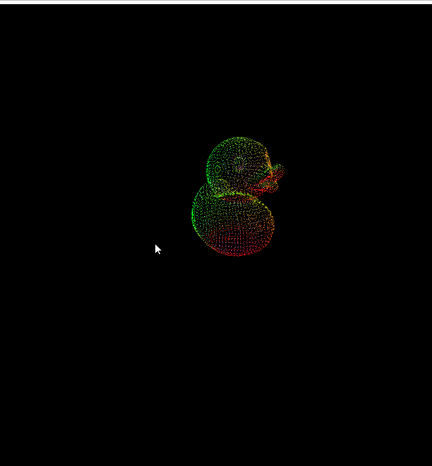 | 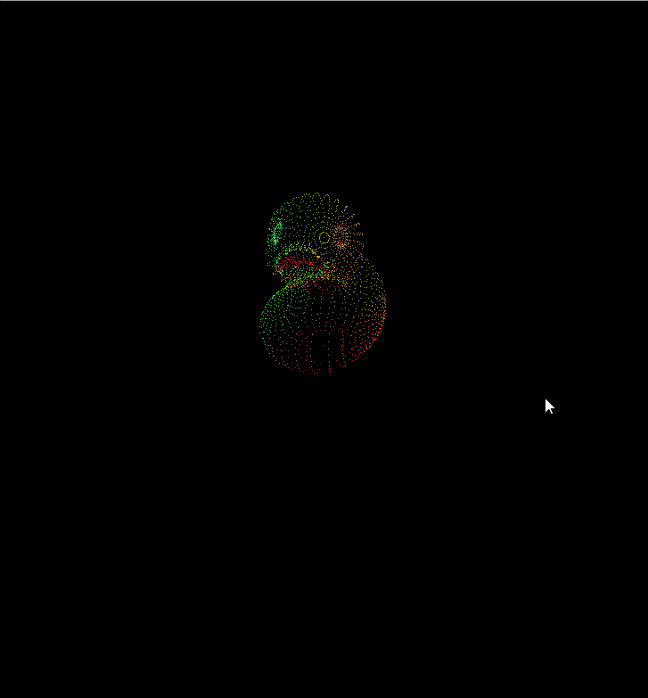

Here is a demo of rasterizing points; the user is allowed to specify the sparsity of the point cloud on the top of raterize.cu.

Checkerboard with perspective correction | Checkerboard without perspective correction
:-------------------------:|:-------------------------: 
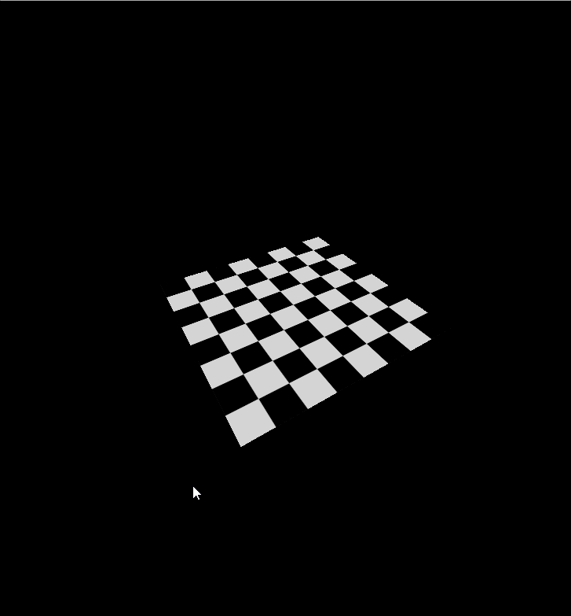 | 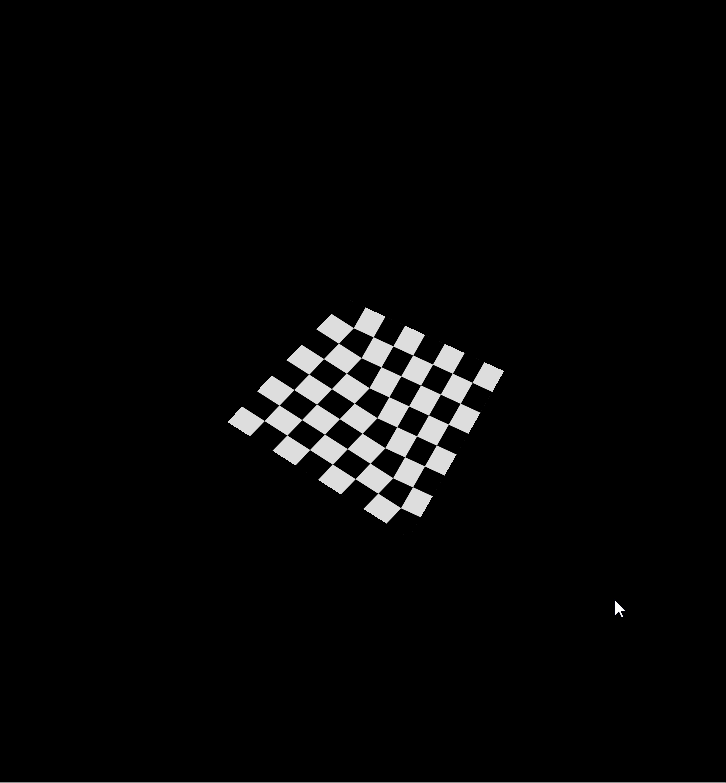

Perspective correction: please see the reference https://en.wikipedia.org/wiki/Texture_mapping#Perspective_correctness. Without perspective correction,
we can observe the 'distorted' image generated from the raterization pipeline.

Checkerboard with bilinear filtering | Checkerboard without bilinear filtering
:-------------------------:|:-------------------------: 
 | 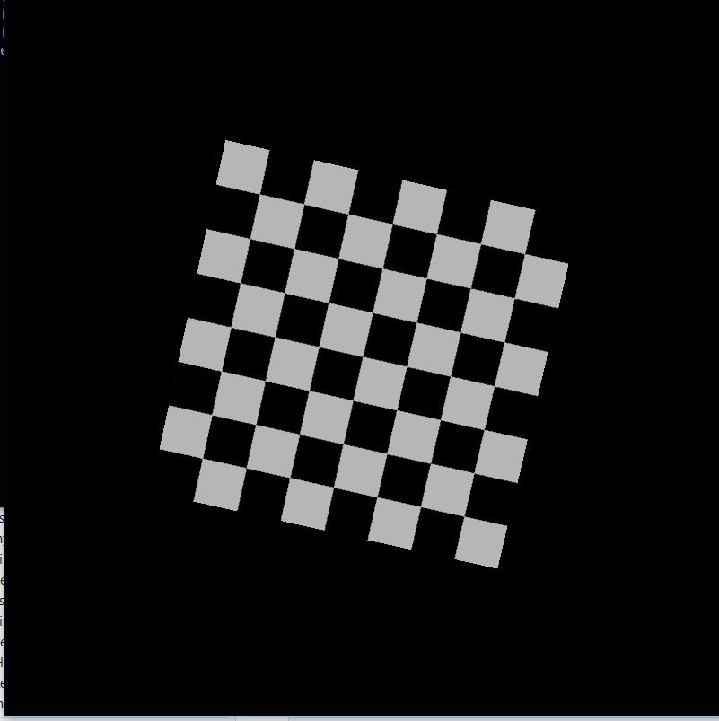

Bilinear filtering, reference https://en.wikipedia.org/wiki/Bilinear_filtering, we can observe the smoothing effect on the lines over the checkerboard.

Cow | Di|Engine | Buggy| Flower with Lines
:-------------------------:|:-------------------------: |:-------------------------:|:-------------------------: |:-------------------------: 
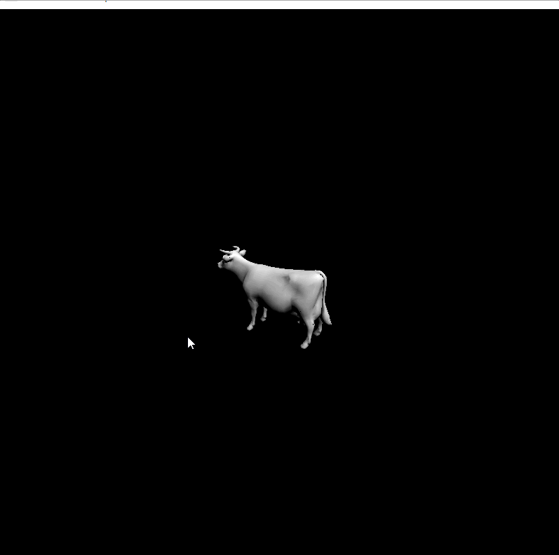 | 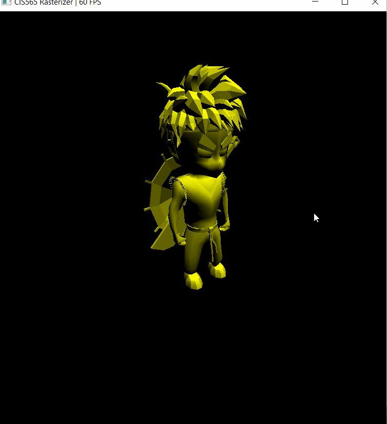 |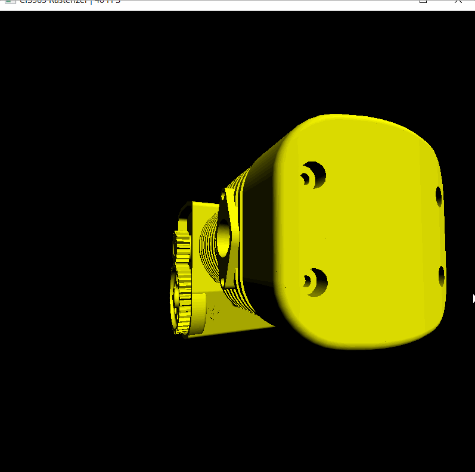 | 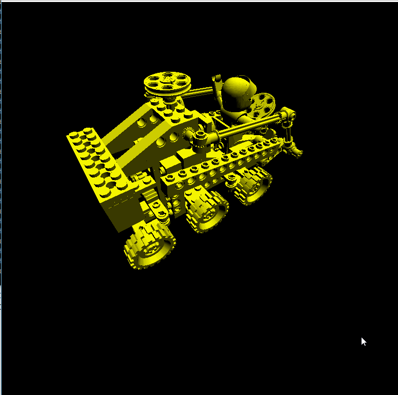  | 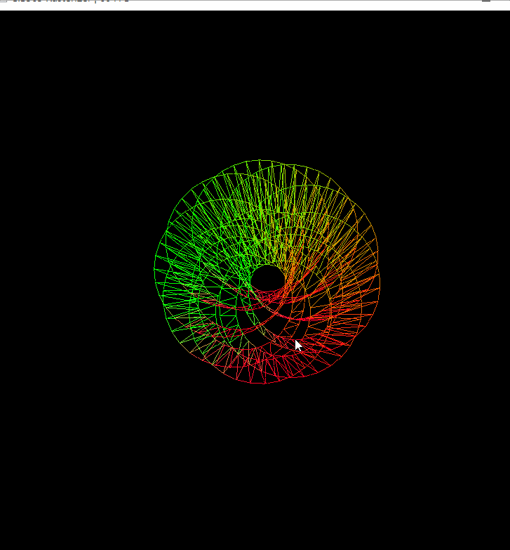

# Analysis

Pipeline Timing(ms) - VC | Pipeline Timing(ms) - Cow |Pipeline Timing(ms) - Box
:-------------------------:|:-------------------------:  |:-------------------------:
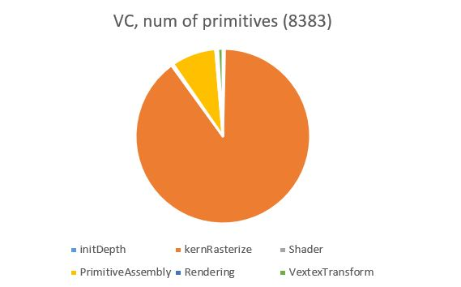 | 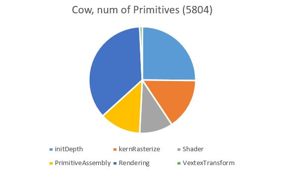 |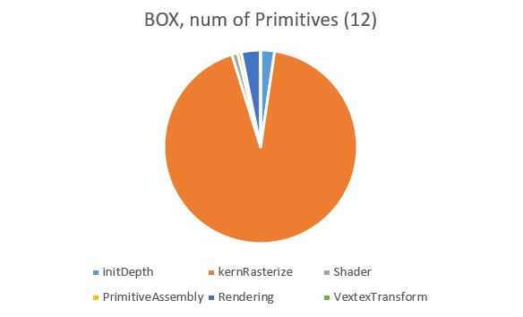
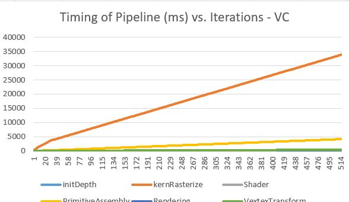 | 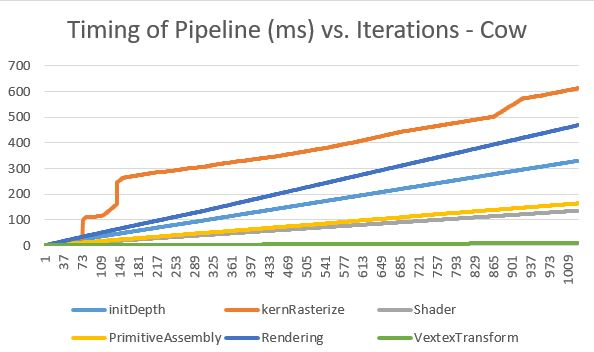 |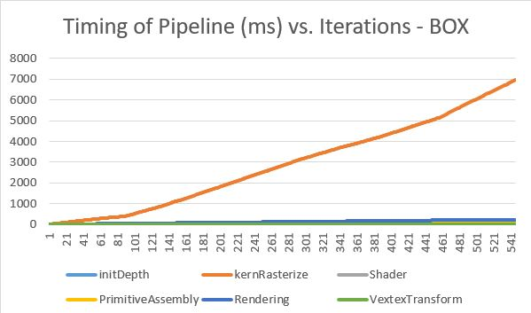
triangle width-mean :20 |  triangle width-mean :2~3 |triangle width-mean :77

Charts above shows that the number of primitives is not the dominant factor effecting the breakdown of time spent in each pipeline stage. 
Indeed, the stage that consumes most of the time is rasterizing; however, it's not proportional to the number of primitives.
In cases of cow, we have >5000 primitives in total, the rasterizing stage only consumes 36 percent of the total time;
on the contrast, the box only has 12 primitives, the rasterizing consumes more than 93 percent of the total time. 
A more careful examination of the rasterizing stage reveals another important factor in the rasterizing stage: the primitive size.
As for each kernel we have to iterate through the entire boundary box to compute each fragments within a triangle, increasing the average triangle size 
might significantly decrease the performance. If we can saturate the threads as much as possible while decrease the average size of the triangle, we
can expect an improvment in the performance.

On the other hand, in case our average triangle is small enough, we might need to concern about memory allocation and access. We
could for example, use shared memomry to decrease the overhead of memomry allocation and access for initializing the depth buffer as well as the memory access in other kernel functions (we can find more evidence 
as we observe the overhead of primitive assembly, rending and depth init in the left two charts).
It would be cool to implement tile based rasterizing in the future.

*PS: looking for models: just we & just tank : ]

*CMakeLists change
 'common.h' file is added to the cmakelist file; sm20 --> sm61.

### Credits

* [tinygltfloader](https://github.com/syoyo/tinygltfloader) by [@soyoyo](https://github.com/syoyo)
* [glTF Sample Models](https://github.com/KhronosGroup/glTF/blob/master/sampleModels/README.md)
