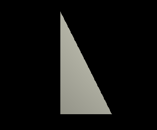
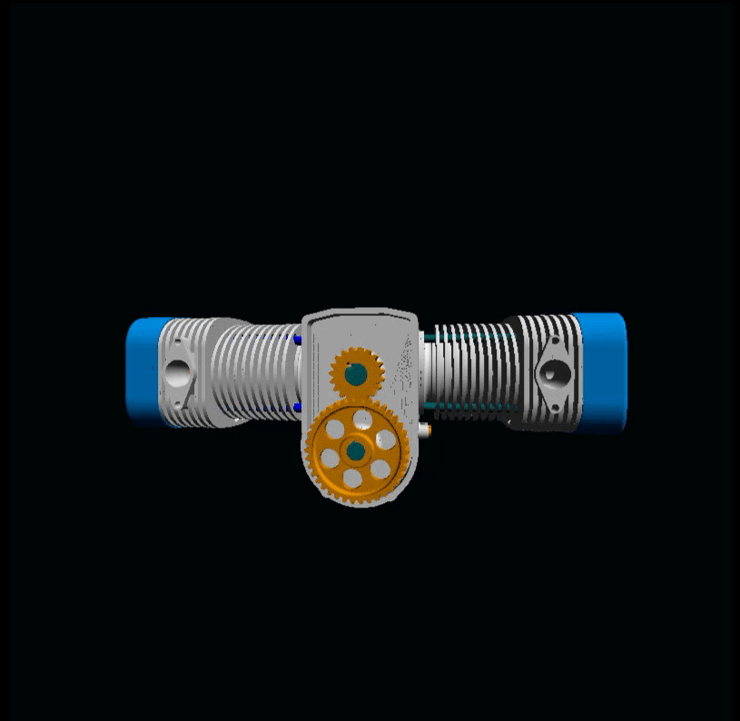

CUDA Rasterizer
===============

**University of Pennsylvania, CIS 565: GPU Programming and Architecture, Project 4**

* Rony Edde (redde)
* Tested on: Windows 10, i7-6700k @ 4.00GHz 64GB, GTX 980M 8GB (Personal Laptop)

This is a rasterizer running on the GPU using CUDA.
* 

### Credits
* [tinygltfloader](https://github.com/syoyo/tinygltfloader) by [@soyoyo](https://github.com/syoyo)
* [glTF Sample Models](https://github.com/KhronosGroup/glTF/blob/master/sampleModels/README.md)

* Features
  * Support for polygonal geometry.
  * Texture mapping with perspective correction.
  * Shaded polygon, line and point rendering.
  * Correct attribute interpolation.
  * Gouraud and specular shading.
  * MSAA anti aliasing.
  * SSAA super sampling anti aliasing.
  * Backface culling with removal optimization.
  * Depth sorting primitive ordering by depth.
  * Axis aligned bounding box optimization.

* Controls
  * Esc to exit
  * S to enable / disable specular.
  * W to change display mode to polygons/lines/points.
  * P to enable / disable perspective correction for textures.
  * A to enable / disable antialiasing (MSAA or SSAA depending on mode).
  * C to enable / disable backface culling.
  * T to enable / disable performance testing.
  * B to enable / disable axis aligned bounding box optimization.
  * X to enable / disable cheap culling.  This is faster but not advised as it can lead to artifacts in renders.
  * IMPORTANT NOTE:  To enable supersampling, you must change line 22 in main.cpp to this and recompile:  
    * static bool supersample = true;  

* Polygonal geometry.
  * Drawing our first triangle to check if all projection, camera, and geometry
    are all correct.
    *   
    extending this to a more complex model:
    *   
  * Now we can start looking up texture data and apply the texture with the model's uvs.
    Reading uv information and using simple barycentric coordinates give us textures.
    However, these textures are not perspective correct due to the projection.
    Initial result:
    *   
    By dividing with z, we can recompute the correct uv values after projection.  We now
    have perspective correct textures:
    *   
    
    * Shaded polygon, line and point rendering.
    Now that we have textures, we can apply shading models.  We start with a simple gouraud 
    shader which shades the surface based on the light angle.  In this rendering stage, if we apply
    the shading without textures we get the following result:  
    *   
    Multiplying by the texture color, we get this:  
    *   
    The second stage is to get some specular highlights.  We compute the specular by calculating the 
    incident vector from the camera and the light vector.  Here's the final result with gouraud
    specular and texture combined.  
    * 
    * correct attribute interpolation is essential in preserving surface normals continuity and texture
    mapping.  Every attribute in interpolated in order to preserve the smooth transitions.
    
    * Render types.
    We can also chose how to render our primitives.  Instead of rendering the full polygon, we can choose
    to render the edges or the points.  We can also specify a width.  The following renders use a width of
    0.04:
    * 
    
    * MSAA anti aliasing.
    In order to achieve MSAA, we must check for each pixel multiple times.  Each time we compute the color at
    a pixel counts as 1 sample.  Multi sampling means that we must take multiple samples at the same pixels.
    Each sample is shiften within the pixel area.  We use 4 samples to achieve MSAA.  Here are the results:  
    *   
    *    
    
    * SSAA anti aliasing.
    An alternative to MSAA is to simply render the image with 4 times the resolution and downsample the final image.
    A simple downsampling would consist of taking the closest pixel and assigning it to the lower resolution image.
    This, however would not take advantage of the additional rendered pixels, to in order to take advantage of this,
    we enable antialiasing by taking the average of the 4 pixels in the high resolution image and assigning that value
    to the target low resolution pixel.  This is a costly approach but well worth it.  Here's the result:  
    *   
    The result is a much cleaner image than MSAA at the cost of performance.  
    
    * Backface culling with removal optimization.
    At this stage, rendering an image is starting to take a considerable hit in performance.  Backface culling can
    help reduce this impact by removing faces with normals opposed to the camera look at vector.  By removing these
    faces, we can benefit by rendering less polygons and improve performance.  Here's the result:  
    *   
    
    * Depth sorting.
    Further optimization can be done by sorting the polygons by the depth just before we compute the color.
    This reduces the overhead of overlapping polygons and ensures that we walk the scene front to back, never hitting
    a polygon that will have to be eliminated in the loop.  We can be as bold as to stop checking for polygons once we hit
    the first.  This can improve performance but could lead to clipping when polygons intersect.  Alternatively we can limit
    the intersecting polygons to a certain number and take advantage of that but it's not always safe to do so it's ignored.
    
    * Axis aligned bounding box optimization.
    Performance is still an issue with the additional shading and post processing.  Complex scenes are a bottleneck.
    In order to avoid this, we check each primitive's bounding box before we compute barycentric coordinates.  This is a very
    cheap computation since everything is in screen space and we only need to compare with the pixel coordinates.  If the polygon's
    bounding box encompasses the pixel we're rendering, then we can compute the barycentric coordinate and check intersections.
    This eliminates most geomtry in the scene right away and give a considerable boost in performance.
    We now can load complex models that were previously problematic.
    *   
    *   
    *   
    
    
### Analysis
  * The analysis shows that the most expensive computaion is with the scanline function.  It is to be expected since
  this is where most geometric computations happen.  
  * The benchmarks were conducted across an average of about 30 frames per test and the functions analysed were the following:  
    * vertexTransformAndAssembly, referred to as vertexTandA.  This is where the geometric data is assembled for pushing to the scanliner.
    * scanline, referred to as scanline.  This is where the triangle data is fed through every fragment and where the barycentric computations occur.  This is also where the normals and other attributes are interpolated and textures assigned.
    * anti-aliasing, referred to as aa.  This is where MSAA 4x is computed, it's not enabled when supersampling is turned on so it will take no resources when it's either off or supersampling is on.
    * render, referred to as render is where shading occurs.  gouraud and specular shading are computed and multiplied with the texture data and the framebuffer is then assigned the final color.
    * downsample, referred to as downsample, is where the image is downsampled.  This is also where anti-aliasing is computed when supersampling is turned on.  Not to be confused with the MSAA 4x computation and timing.
    
  * Results:
    * The pie charts give a better overall estimation to the most costly functions while the final bar chart shows a more elaborate comparison between the different optimizations.
    * This is the optimized run without antialiasing.  We can see that most functions take a very low percentage since the scanline function is not hindered by anti-aliasing or supersampling.  This is using backface culling with zdepth ordering and axis aligned bounding box optimization.  Note that aa and downsample take up 0% since they are not being called:  
      *   
    * Now with backface culling and zdepth sorting disabled and only AABB enabled, there is a small dip in performance that will be visible in the final graph.  But looking at the chart, we see that more time is spent in the scanline function doing more work.  This is due to the freeing of resources taken by sorting and the culling.  Note that these resources had a minimal impact on performance.
      *   
    * Now with backface culling enabled and AABB disabled, there is a bigger dip in performance.  Again, most resources are spent in the scanline function doing more work.
      *     
    *  Disabling all optimizations shows that most of the time spent by the GPU is in the scanline function.  This chart will not show the dip in performance but it clearly shows that the most expensive function is the scanline.
      *      
    * Enabling MSAA 4x with all optimizations shows something interesting, albeit expected.  Most of the resources are still in the scanline function but 24% of the resources used by the scanline function are now dedicated to the MSAA function.  Sampling sub pixels 4 times is expected to dip the performance.
      *   
    * Enabling MSAA 4x without any optimization was obviously going to slow things down a lot more.  We do see a dip in performance as the render function is using slightly less resources now.  Going from 0.4% to 0.1% might not look like much but this is a percentage which means that the loss is considerable.  Effectively we see a 4x decrease in render performance.
      * 
    * SSAA is rendering a 4x supersample of the image and downsampling it by averaging the 4 nearest pixels.  Here we see again something expected.  Similar to the first 2 charts, we can see that almost all resources are spent in scanline due to the 4x resolution increase.
      * 
    * SSAA without any optimization was not going to change much of the resource distribution but we can clearly see that almost all resources are dedicated to the scanline function at 99.5%.
      * 
      
    * Finally for a better visualization of performance with function distribution, we lay the data is box chart format.
    * 
    * Now we can see the time taken with optimizations enabled.  Less than 50 milliseconds per frame as opposed to over 900 milliseconds with supersampling and no optimizations.  It's also interesting to note that MSAA uses lightly less resources than SSAA.
    * Another point is that the axis aligned bounding box offers a considerable benefit for performance.  Disabling it cuts the render time by half.
    * Backface culling had an almost identical improvement as AABB albeit slightly less noticeable but that would vary from scene to scene.  These benchmarks were used on the same scene view and geometry.  
    *  The combination of backface culling and AABB reduced render times from 220ms to less than 50ms.  An almost 5x improvement.
    *  Another thing that catches the eye is the downsampling and antialiasing hit on performance.  We can see the resources being used a lot more when MSAA is enabled.  It's less obvious with SSAA, considering that the scanline function is rendering more than it would if SSAA is disabled, the only hit in performance would be visible in the total render time.

