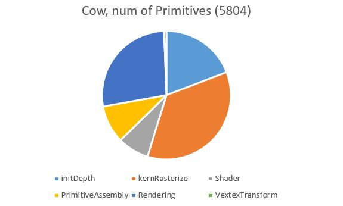

CUDA Rasterizer
===============

**University of Pennsylvania, CIS 565: GPU Programming and Architecture, Project 4** 

* Xiang Deng
* Tested on:  Windows 10-Home, i7-6700U @ 2.6GHz 16GB, GTX 1060 6GB (Personal Computer)

**Features:**

* Basic pipeline
  * Vertex assembly and vertex shader
  * Primitive assembly
  * Rasterization
  * Depth test
  * Fragment shader (with lambert lighting)
  * Fragment-to-depth-buffer writing (with atomics for race avoidance).
  * A depth buffer for storing and depth testing fragments. 
* UV texture mapping with bilinear texture filtering and perspective correct texture coordinates
* Support for rasterizing additional primitives: lines and points

Milk truck | Duck
:-------------------------:|:-------------------------: 
 |  

VC

Cow with Lines | VC with Lines |Truck with Lines 
:-------------------------:|:-------------------------:  |:-------------------------:
 |  |

Duck with Points (dense) | Duck with Points (sparse)
:-------------------------:|:-------------------------: 
 | 

Checkerboard with perspective correction | Checkerboard without perspective correction
:-------------------------:|:-------------------------: 
 | 

Checkerboard with bilinear filtering | Checkerboard without bilinear filtering
:-------------------------:|:-------------------------: 
 | 

Cow | Di|Engine | Buggy| Flower with Lines
:-------------------------:|:-------------------------: |:-------------------------:|:-------------------------: |:-------------------------: 
 |  | |   | 

# Analysis

Pipeline Timing(ms) - VC | Pipeline Timing(ms) - Cow |Pipeline Timing(ms) - Box
:-------------------------:|:-------------------------:  |:-------------------------:
 |  |
 |  |
triangle width-mean :20 |  triangle width-mean :2~3 |triangle width-mean :77

Charts above shows that the number of primitives is not the dominant factor effecting the breakdown of time spent in each pipeline stage. 
Indeed, the stage that consumes most of the time is rasterizing; however, it's not proportional to the number of primitives.
In cases of cow, we have >5000 primitives in total, the rasterizing stage only consumes 36 percent of the total time;
on the contrast, the box only has 12 primitives, the rasterizing consumes more than 93 percent of the total time. 
A more careful examination of the rasterizing stage reveals another important factor in the rasterizing stage: the primitive size.
As for each kernel we have to iterate through the entire boundary box to compute each fragments within a triangle, increasing the average triangle size 
might significantly decrease the performance. If we can saturate the threads as much as possible while decrease the average size of the triangle, we
expect an improvment in the performance.

#PS: looking for models: just we & just tank

### Credits

* [tinygltfloader](https://github.com/syoyo/tinygltfloader) by [@soyoyo](https://github.com/syoyo)
* [glTF Sample Models](https://github.com/KhronosGroup/glTF/blob/master/sampleModels/README.md)
