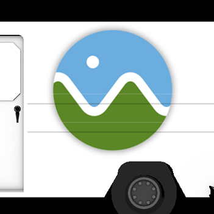

CUDA Rasterizer
================

**University of Pennsylvania, CIS 565: GPU Programming and Architecture, Project 3**

* Trung Le
* Windows 10 Home, i7-4790 CPU @ 3.60GHz 12GB, GTX 980 Ti (Person desktop)

# Device information

### General information for CUDA device
- Device name: GeForce GTX 980 Ti
- Compute capability: 5.2
- Compute mode: Default
- Clock rate: 1076000
- Integrated: 0
- Device copy overlap: Enabled
- Kernel execution timeout: Enabled
 
### Memory information for CUDA device

- Total global memory: 6442450944
- Total constant memory: 65536
- Multiprocessor count: 22
- Shared memory per multiprocessor: 98304
- Registers per multiprocessor: 65536
- Max threads per multiprocessor: 2048
- Max grid dimensions: [2147483647, 65535, 65535]
- Max threads per block: 1024
- Max registers per block: 65536
- Max thread dimensions: [1024, 1024, 64]
- Threads per block: 512

# Rasterizer

The rasterizer implements 

# Features

- [UV texture mapping](##UVTextureMapping)

Added a new material struct. Passing by materials.

# Flags

The following header flags can be found in `rasterize.cu`:

- `#define RENDER_DEPTH_ONLY`: Uncomment to render with z-buffer only
- `#define RENDER_NORMAL_ONLY`: Uncomment to render with eye space normals only
- `#define BILINEAR_FILTERING`: Uncomment to enable bilinear filtering
- `#define NOT_USE_TEXTURE`: Uncomment if the model doesn't have a texture file
- `#define USE_K_BUFFER`: Uncomment if using independent order transparency with k-buffer

(not working, please ignore)
- ~~`#define BACKFACE_CULLING`~~

The following header flags can be found in `main.cpp`:
- `#define USE_CENTAUR_MODEL`: Uncomment if using the `cent.gltf` model
- `#define USE_HEAD_MODEL`: Uncomment if using the `head.gltf` model
- `#define USE_ENGINE_MODEL`: Uncomment if using the `2_cylinder_engine.gltf` model

# Performance analysis

The bottleneck of the rasterizer happens in the `_rasterize` kernel. While all triangles are processed in parallel, we still need to use a for loop through the triangle bounding boxes. Each `_rasterize` kernel is bounded by O(n2).

For testing, I am using the following scenes:

|   | Triangle count | Source | 
|---|---|---|
| Cow | 5804 | [gltfs](gltfs/cow/cow.gltf) |
| Head | 17684 | [gltfs](gltfs/head/head.gltf) |
|2 cylinder engine| 121496 | [gltfs](gltfs/2_cylinder_engine/2_cylinder_engine.gltf) |

The following graph shows the execution time in microseconds:

## UV Texture Mapping
### 1. Perspective correct

### 2. Bilinear filtering

Toggle with `#define BILINEAR_FILTERING`

Bilinear filtering is an antialiasing technique that averages the neighboring texels of a texel to create smooth effect when the texture is zoomed in or zoomed out.

Below shows the comparison with bilinear filtering on (left) and off (right). Bilinear filtering makes the wavy curve on the Cesium logo appear to be smoother and not pixelated.

Bilinear **ON**        | Bilinear **OFF**
:-------------------------:|:-------------------------:
|

## Order independent transparency using k-buffer

Toggle with `#define USE_K_BUFFER`

k-buffer is a generalized version of the traditional z-buffer for depth. Instead of storing a single depth as in the z-buffer, k-buffer stores a list of depths for overlapping fragments. This information allows us to compute the alpha blending color of these multiple overlapping fragments in screenspace.

[insert photo]

### Credits

* [tinygltfloader](https://github.com/syoyo/tinygltfloader) by [@soyoyo](https://github.com/syoyo)
* [obj2gltf](https://github.com/AnalyticalGraphicsInc/OBJ2GLTF) by [AnalyticalGraphicsInc](https://github.com/AnalyticalGraphicsInc)
* [Implementing Weighted, Blended Order-Independent Transparency](http://casual-effects.blogspot.com/2015/03/implemented-weighted-blended-order.html) by Morgan McGuire
* [k-buffer](http://www.inf.ufrgs.br/~comba/papers/2007/kbuffer_preprint.pdf) by Morgan McGuire

### Models
* [glTF Sample Models](https://github.com/KhronosGroup/glTF/blob/master/sampleModels/README.md)
* [octocat]() by [Sally Kong](https://sketchfab.com/models/cad2ffa5d8a24423ab246ee0916a7f3e). Model is converted using [obj2gltf](https://github.com/AnalyticalGraphicsInc/OBJ2GLTF).
* [wolf]() by [Rachel Hwang](https://www.linkedin.com/in/rachel-hwang-84a3b989). Model is converted using [obj2gltf](https://github.com/AnalyticalGraphicsInc/OBJ2GLTF).
* [centaur model](http://tf3dm.com/3d-model/free-base-mesh-centaur--67384.html) by [BAQStudio](http://tf3dm.com/user/baqstudio), Model is converted using [obj2gltf](https://github.com/AnalyticalGraphicsInc/OBJ2GLTF).
* Infinite, [3D Head Scan]() by Lee Perry-Smith is licensed under a Creative Commons Attribution 3.0 Unported License. Based on a work at www.triplegangers.com. This distribution was created by Morgan McGuire and Guedis Cardenas http://graphics.cs.williams.edu/data/. See [LICENSE](/gltfs/head/Infinite-Scan_License.txt). Model is converted using [obj2gltf](https://github.com/AnalyticalGraphicsInc/OBJ2GLTF).

