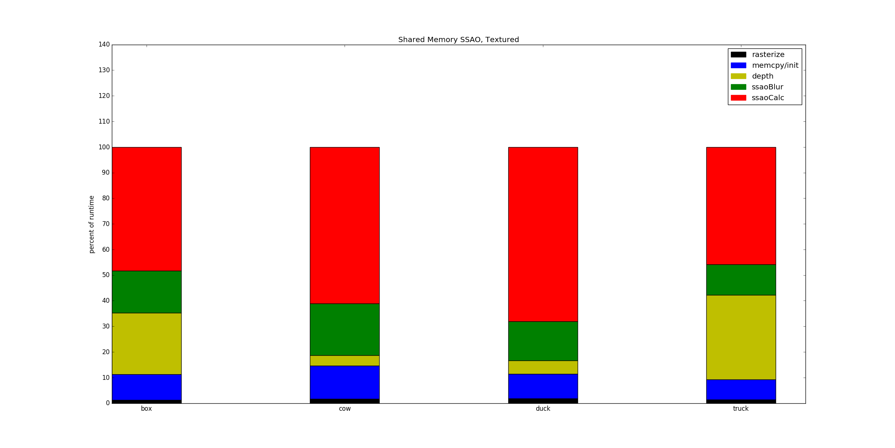

CUDA Rasterization Pipeline
======================

**University of Pennsylvania, CIS 565: GPU Programming and Architecture, Project 4**

* Daniel Krupka
* Tested on: Debian testing (stretch), Intel(R) Core(TM) i7-4710HQ CPU @ 2.50GHz 8GB, GTX 850M

# About
This is a CUDA rasterization pipeline made for UPenn's CIS565. It features
* GLTF model loading
* Perspective correct diffuse PNG textures
* Screen space ambient occlusion (SSAO)
The pipeline utilizes deferred shading - the `depthPass` kernel performs depth testing and
assembles the G-buffer prior to shading and SSAO.

# Screenshots
Video of the rasterizer in action can be found [here](https://youtu.be/_Y-9eAgICrI).

# Textures
I implemented perspective-correct UV texturing for diffuse coloring, using CUDA's texture memory functionality.

# SSAO
I also implemented SSAO, both using shared memory and without.

# Performance

Interestingly, the
