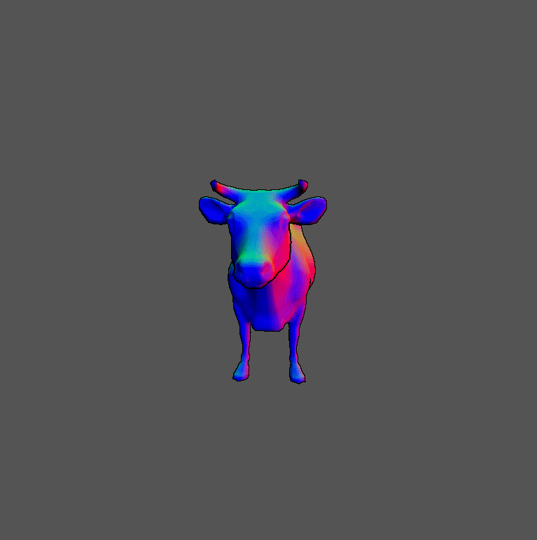

# University of Pennsylvania, CIS 565: GPU Programming and Architecture.
Project 4: CUDA Rasterizer
===============

## User resources
- **Name:** David Grosman.
- **Tested on:** Microsoft Windows 7 Professional, i7-5600U @ 2.6GHz, 256GB, GeForce 840M (Personal laptop).
- **Linked Project with:** "cudadevrt.lib".
Note: You must include "C:\Program Files\NVIDIA GPU Computing Toolkit\CUDA\v8.0\lib\x64\cudadevrt.lib;" in your Project Properties' Linker Input's Additional Dependencies field to get the Project running. This is because I am using thrust::remove_if() for my back-face culling phase.

### Preview

## Project description
This Project's purpose was to gain some experience with writing Graphics code that would benefit as much as possible from CUDA as possible. In fact, a rasterized graphics pipeline, similar to the OpenGL pipeline can be processed by custom kernels handling each primitives, vertices and fragments per kernel.
In this project, I have implemented the following features/pipeline stages:

* Vertex shading. (`_vertexTransformAndAssembly` in `rasterize.cu`)
* Primitive assembly with support for triangles read from buffers of index and
  vertex data. (`_primitiveAssembly` in `rasterize.cu`)
* Rasterization. (`_rasterize` in `rasterize.cu`)
* Fragment shading. Using Blinn-Phong with ambient, diffuse and specular light effects. (`render` in `rasterize.cu`)
* A depth buffer to store and depth test fragments.
* Fragment-to-depth-buffer writing (**with** atomics for race avoidance).
* Toon Shading by Post processing the fragment buffer divided into "tiles" and using Sobel Filter.
* Backface culling, optimized using thrust's stream compaction.
* UV texture mapping with bilinear texture filtering and perspective correct texture coordinates.
* Support for rasterizing additional primitives:
   * Lines or line strips (Press `W` to toggle between model drawing and wireframe mode).
   * Points (Press `P` to toggle between model drawing and point-cloud mode).

### My Pipeline
* Cleared the fragment and depth buffers with some default values in `initFrameBuffers()`
* Vertex shading:
  * `VertexIn[n] vs_input -> VertexOut[n] vs_output`
  * Transformed each vertex from local space to pixel space.
* Primitive assembly.
  * `VertexOut[n] vs_output -> Triangle[t] primitives`
  * Assemble a list of vertices into triangle, line or point primitives for rasterization.
* Back-face culling.
  * Reduce the number of primitives that will be processed through the remainding pipeline.
    * We simply use the primitives' vertices eye-space normals to determine whether a primitive is faced towards the camera or not.
* Rasterization.
  * `Triangle[t], Line[l] or Point[p] primitives -> Fragment[m] rasterized`
  * Parallelized over each primitive
    * If it is a triangle, we only scan over the box around the triangle (`getAABBForTriangle`).
    * If it is a line, we use Bresenham line algorithm which handles all 4 quadrants.
    * If it is a point, we simply convert its coordinates to integer values and color the corresponding pixel.
  * Linearly interpolate eye-space position and normal vertices attributes. 
  * Perform Perspective-Correct interpolation of texture coordinates attributes.
* Fragments to depth buffer.
  * `Fragment[m] rasterized -> Fragment[width][height] depthbuffer`
    * `depthbuffer` is for storing and depth testing fragments.
  * This is done before fragment shading, which prevents the fragment
    shader from changing the depth of a fragment.
  * Since multiple primitives may write fragments to the same pixel in the depth buffer,
    races must be avoided by using CUDA atomics. This is why we convert your depth value
    to a fixed-point `int`, and use `atomicMin` to store it into an `int`-typed depth
    buffer `intdepth`.
* Sobel Filter.
  * Post-Process the fragment buffer to outline the final model's edges which will be highlighted in black for toon-shading. 
  * Simply apply a Sobel kernel on the depth map to figure out over which pixels it is discontinuous: this is where the models edegs are.
* Fragment shading.
  * `Fragment[width][height] depthbuffer ->`
  * Added Blinn-Phong shader with ambient, diffuse and specular light effects.
  * Implemented UV texture mapping with bilinear texture filtering.
* Fragment to framebuffer writing.
  * `-> vec3[width][height] framebuffer`
  * Simply copies the colors out of the depth buffer into the framebuffer (to be displayed on the screen).
    

The above diagram shows the correctness of our perspective correct texture coordinates interpolation.

### Performance Analysis

From the graph above, we notice that:
  1. The rasterization stage is the most costly since it must determine whether a pixel is part of a primitive or not.
  2. The Intialization of the Frame buffers, their final transfer to OpenGL and the Sobel Mapping used for toon-shading always take the same amount of time since they compute the exact same operation on exactly the same sized-data (every pixel).
  3. The vertex shader is the least costly operation. This is because it is not only an embarassingly parallel problem but it also mostly involve FPU computations which the GPU is very good at.

As seen in the table above, backface culling isn't improving much the overall performance of the rasterizer. This is because there are a lot of data that needs to be sorted and removed from the primitives array (depending on whether a primitive is back-face culling). I would expect the operation to be much faster in OpenGL where it may be processed directly by the hardware itself.

### Postview

### Credits

* [tinygltfloader](https://github.com/syoyo/tinygltfloader) by [@soyoyo](https://github.com/syoyo)
* [glTF Sample Models](https://github.com/KhronosGroup/glTF/blob/master/sampleModels/README.md)
* [Bresenham Line Drawing Algorithm](http://groups.csail.mit.edu/graphics/classes/6.837/F99/grading/asst2/turnin/rdror/Bresenham.java): Source-code which I placed in my Code directly. Note that I implemented line and more advanced scanning algorithms in my undergraduate studies but couldn't find my code...
* [Sobel Kernel] (https://blog.saush.com/2011/04/20/edge-detection-with-the-sobel-operator-in-ruby/): Useful materials for understanding the concepts behind sobel kernels.
* [Perspective-Correct texture coordinates] (http://www.scratchapixel.com/lessons/3d-basic-rendering/rasterization-practical-implementation/perspective-correct-interpolation-vertex-attributes): Good ressource for understanding Perspective-correct interpolation.
* [Bilinear-Filtering] (https://en.wikipedia.org/wiki/Bilinear_filtering)
