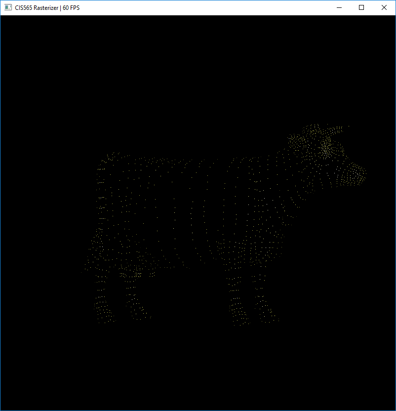
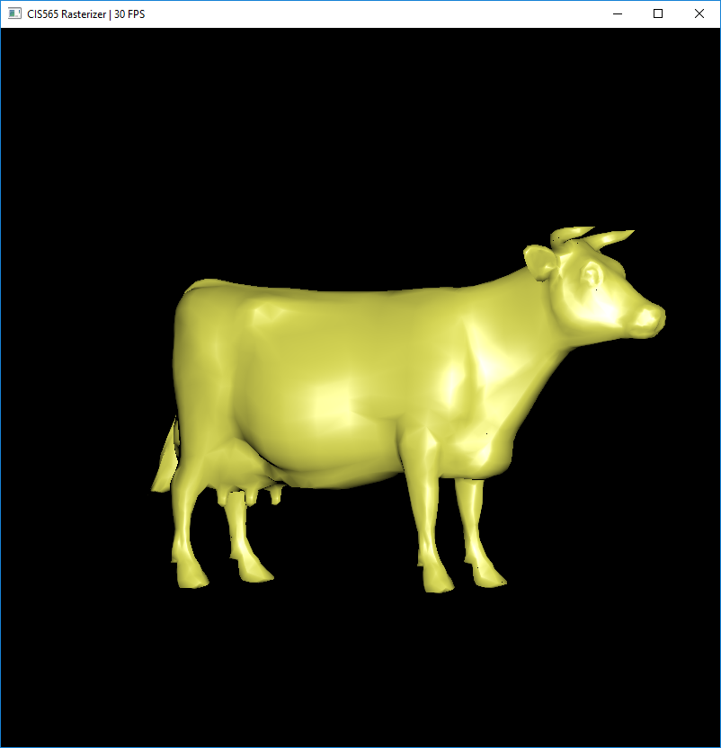
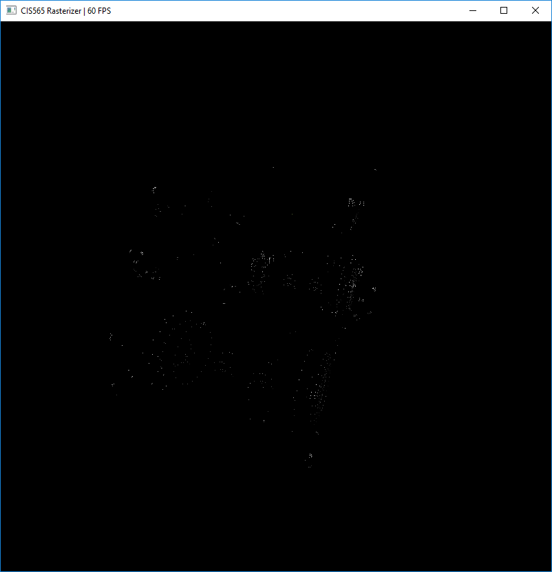
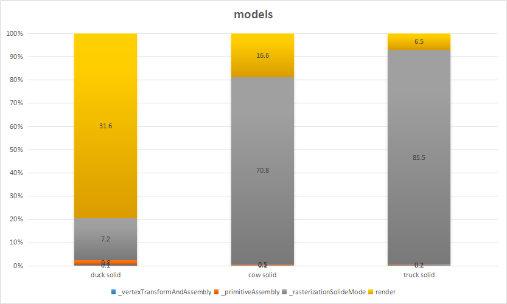
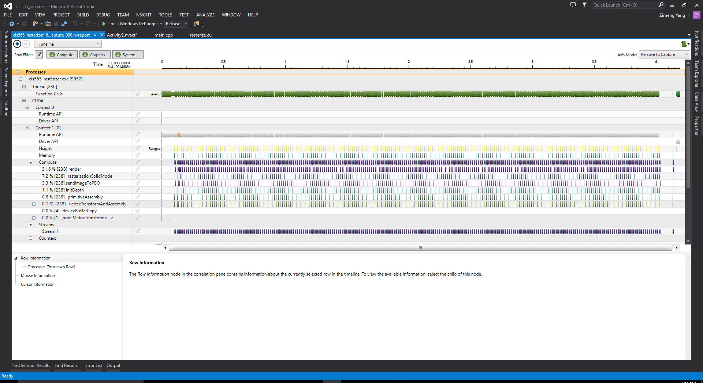

CUDA Rasterizer
===============

**University of Pennsylvania, CIS 565: GPU Programming and Architecture, Project 4**

* Zimeng Yang
* Tested on: Windows 10, i7-4850 @ 2.3GHz 16GB, GT 750M (Personal Laptop)

### Features
* Rasterization
* Blinn-Phong shading
* Texture mapping with bilinear filter and perspective correct texture coordinates
* Rasterization for points and lines 

### Overview

### Pipeline Overview

* Vertex Shading (apply Model, View, Projection transform and assembly vertexOut )
* Primitive Assembly (assembly vertices to primitives)
* Rasterization (fill in every fragment inside each primitive)
* Fragment Shading (apply fragment shading using pos, nor and texCoords information, BlinnPhong shading applied)
* Write Fragment Buffer to Frame Buffer (send current frame to display)

### Screenshots

#### Bilinear Texture Interpolation Comparison

Bilinear interpolation will reduce the aliasing of texture.

|without bilinear interp| with bilinear interp|
|----|----|
|||

#### Perspective Correction

Applying perspective correction will make texture non-distorted.

|without perspective correction | with perspective correction|
|----|----|
|||

#### Rasterization of Line and Point

Additional rasterization types:

for cow model:

|point|wireframe|solid|
|----|----|----|
||||

for truck model:

|point|wireframe|solid|
|----|----|----|
||||

### Performance Analysis

#### Different Models

For these three different models, using solid rasterization. More complex the model is, more percentage the rasterization stage will take.
The percentage of render stage will decrease with the increasement of model complexity.

Details:

|duck.gltf|cow.gltf|truck.gltf|
|----|----|----|
||||

#### Texture Mapping and Perspective Correct Coordinates

The performance impact of applying bilinear interpolation:

The performance impact of applying perspective correct coordinates:

The bilinear interpolation will be applied during rendering stage. From the comparison above, the render stage percentage will increase due to the applying of bilinear interpolation.

The perspective correction will be applied during rasterization stage. Since it will introduce more computation and interpolations during correction, the rasterization state percentage increase drastically.

Details:

|no bilinear interp|no perspective correction|
|----|----|
|||

#### Rasterization for Points and Lines

The three different rasterization type for same model: truck. (with bilinear texture interp and perspective correction)

Since number of fragments are increasing from point to line and then solid mode. The rasterization percentage will increase drastically too.

Details:

|points|lines|
|----|----|
|||

### Bloopers
hairy duck (line rasterization error):

### Credits

* [tinygltfloader](https://github.com/syoyo/tinygltfloader) by [@soyoyo](https://github.com/syoyo)
* [glTF Sample Models](https://github.com/KhronosGroup/glTF/blob/master/sampleModels/README.md)
