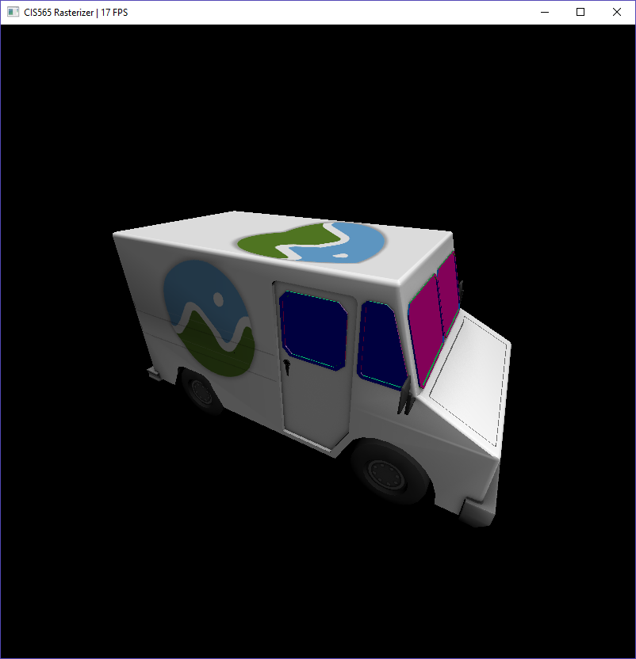

CUDA Rasterizer
===============

**University of Pennsylvania, CIS 565: GPU Programming and Architecture, Project 4**

* Austin Eng
* Tested on: Windows 10, i7-4770K @ 3.50GHz 16GB, GTX 780 3072MB (Personal Computer)

<table class="image">
	<tr>
	<td></td>
	<td></td>
	<td></td>
	<td></td>
	</tr>
	<tr>
	<td>Diffuse color</td>
	<td>Testing texture coordinates</td>
	<td>Incorrect texture reading</td>
	</tr>
</table>

## Perspective Correct Interpolation

Incorrect interpolation that does not take perspective distortion into account results in distorted texture mapping. This is because the perspective projection is not linear with respect to depth. As a result, projected textures can appear skewed if not corrected.

## Bilinear Texture Filtering

Interpolated texture coordinates are rarely ever exactly aligned with texels. Texture artifacts can occur when the interpolated texel jumps to an adjacent one. To avoid this problem, we grab the four pixels neighboring our interpolated texture coordinate and bilinearly interpolate between them. This results in a much smoother image.

## Analysis

*Performance tests were done using the above render. Unless stated otherwise, reported results are the average over all the frames or a breakdown of per-frame data.*

### Constant Memory Camera Matrices

Storing camera matrices in constant memory made barely any improvement in kernel execution time even though it drastically reduced register usage and improved occupancy. This may be because the vertex transform kernel is already relatively fast, taking just 13 microseconds. More on this later, but this cost may be cheap enough that it's beneficial to do additional vertex transform computation if multiple types of vertex data are desired (requiring multiple reads).

### Bilinear Interpolation

Even though adding bilinear interpolation nearly doubled the number of registers used (26 to 48), there was surprisingly no decrease in occupancy. As a result, the bilinear interpolation only suffered a small performance hit of about 40 microseconds. This is surprising because the kernel needs to make four global memory reads for the texture instead of just one. Perhaps this latency is hidden by the extra computation to blend the colors. One possible improvement may be to use shared memory to speed up the four texture reads because fragments with adjacent UV coordinates need to look up the same texture values.

### Perspective Correct Interpolation

Perspective correct interpolation doubled the execution time of the interpolation kernel while barely using any additional resources (3 registers). Because it is just a few extra arithmetic computations, the additional latency is probably from the additional global memory read to read the primitive's 3D position relative to the eye. If this truly is the case, there may be performance improvements by not storing transformed vertex positions and instead recomputing these in the kernel with matrices stored in constant memory.

### Optimized Barycentric Interpolation

The optimized barycentric interpolation is able to compute the next pixel's barycentric coordinates using the previous coordinates and three add operations. This is significantly less than the typical 5 adds and 2 multiplys. However, this comes at the cost of using five additional registers and decreased occupancy. This graph shows that the extra resources to decrease computation are well worth it in this situation. Clever ways to decrease the number of registers may help even more.

### Separated Rasterization and Interpolation

In my initial implementation of the project, I naively interpolated and copied primitive attributes to the fragment right after doing the depth test. This means that any time a thread won the depth test, all other threads would have to wait for it to interpolate the data and write to memory. Separating the decision of which primitive should get rendered in the fragment and the actual interpolation and data copy yielded significant performance benefits. Even though the interpolation is very fast (on average just 0.09ms and not even visible on the graph), doing it during triangle projection kills performance. Separating them yields nearly a 10x speedup.

### Credits

* [tinygltfloader](https://github.com/syoyo/tinygltfloader) by [@soyoyo](https://github.com/syoyo)
* [glTF Sample Models](https://github.com/KhronosGroup/glTF/blob/master/sampleModels/README.md)
* [Optimized barycentric interpolation](https://fgiesen.wordpress.com/2013/02/10/optimizing-the-basic-rasterizer/)
