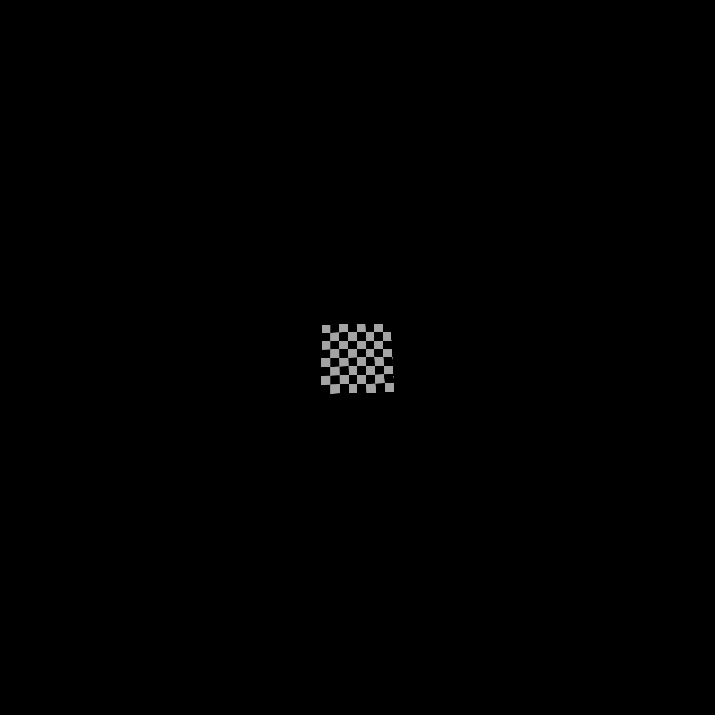
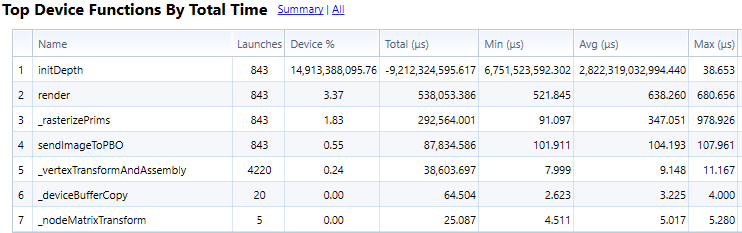

CUDA Rasterizer
===============

[CLICK ME FOR INSTRUCTION OF THIS PROJECT](./INSTRUCTION.md)

**University of Pennsylvania, CIS 565: GPU Programming and Architecture, Project 4**

* Akshay Shah
* Tested on: Windows 10, i7-5700HQ @ 2.70GHz 16GB, GTX 970M 6GB (Personal Computer)

### GPU Rasterizer

Renders:
--------

Textures: with Bilinear Interpolation
-------------------------------------
| Without Bilinear Filtering  | With Bilinear Filtering |
| --------------------------  | ----------------------- |
| ||

And Perspective correct texture coords
--------------------------------------

| Without Perspective correct Texture | With Perspective correct Texture |
| ----------------------------------- | -------------------------------- |
|     |    |

Materials: Diffuse, Specular (Blinn-Phong), Toon Shading
--------------------------------------------------------

| Diffuse | Specular | Toon Shading |
| ------- | -------- | ------------ |
|  |  |  |
Different Primitives: Triangles (default), Lines (wireframe), Points
--------------------------------------------------------------------

| Triangles | Lines | Points |
| --------- | ----- | ------ |
|  |  |  |

### CUDA summary and analysis

The following chart shows the approximate percentage time spent by each cuda function. It is clear that \_rasterizePrims has the largest time spent because of the calculation of barycentric coords and perspective correct texture coords.

-------------------------

This following image shows the percentage time spent while doing the wireframe for the cow.gltf

Here however, we see that the time is most spent in `initDepth`.

And similarly with points

### Credits and References

* [Bilinear Filtering](http://www.scratchapixel.com/code.php?id=56&origin=/lessons/mathematics-physics-for-computer-graphics/interpolation)

* [Blinn-Phong shading](https://en.wikipedia.org/wiki/Blinn%E2%80%93Phong_shading_model)

* [Toon shading](http://rbwhitaker.wikidot.com/toon-shader)

* [Perspective Correct texture](http://www.scratchapixel.com/lessons/3d-basic-rendering/rasterization-practical-implementation/perspective-correct-interpolation-vertex-attributes)

* [tinygltfloader](https://github.com/syoyo/tinygltfloader) by [@soyoyo](https://github.com/syoyo)

* [glTF Sample Models](https://github.com/KhronosGroup/glTF/blob/master/sampleModels/README.md)
