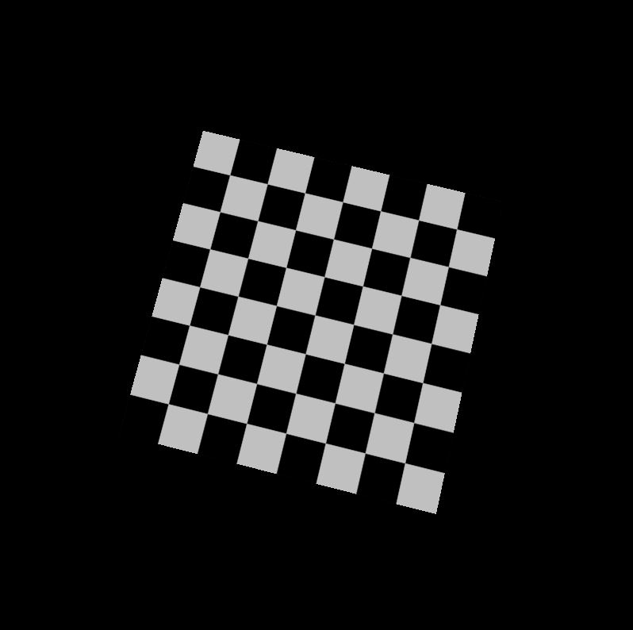

CUDA Rasterizer
===============

**University of Pennsylvania, CIS 565: GPU Programming and Architecture, Project 4** 

* Xiang Deng
* Tested on:  Windows 10-Home, i7-6700U @ 2.6GHz 16GB, GTX 1060 6GB (Personal Computer)

**Features:**

* Basic pipeline
  * Vertex assembly and vertex shader
  * Primitive assembly
  * Rasterization
  * Depth test
  * Fragment shader (with lambert lighting)
  * Fragment-to-depth-buffer writing (with atomics for race avoidance).
  * A depth buffer for storing and depth testing fragments. 
* UV texture mapping with bilinear texture filtering and perspective correct texture coordinates
* Support for rasterizing additional primitives: lines and points

Milk truck | Duck
:-------------------------:|:-------------------------: 
 |  

VC

Cow with Lines | VC with Lines |Truck with Lines 
:-------------------------:|:-------------------------:  |:-------------------------:
 |  |

Duck with Points (dense) | Duck with Points (sparse)
:-------------------------:|:-------------------------: 
 | 

Checkerboard with perspective correction | Checkerboard without perspective correction
:-------------------------:|:-------------------------: 
 | 

Checkerboard with bilinear filtering | Checkerboard without bilinear filtering
:-------------------------:|:-------------------------: 
 | 

Cow | Di|Engine | Buggy| Flower with Lines
:-------------------------:|:-------------------------: |:-------------------------:|:-------------------------: |:-------------------------: 
 |  | |   | 

# Analysis

Pipeline Timing(ms) - VC | Pipeline Timing(ms) - Cow |Pipeline Timing(ms) - Box
:-------------------------:|:-------------------------:  |:-------------------------:
 |  |
 |  |

#PS: looking for models: just we & just tank

### Credits

* [tinygltfloader](https://github.com/syoyo/tinygltfloader) by [@soyoyo](https://github.com/syoyo)
* [glTF Sample Models](https://github.com/KhronosGroup/glTF/blob/master/sampleModels/README.md)
