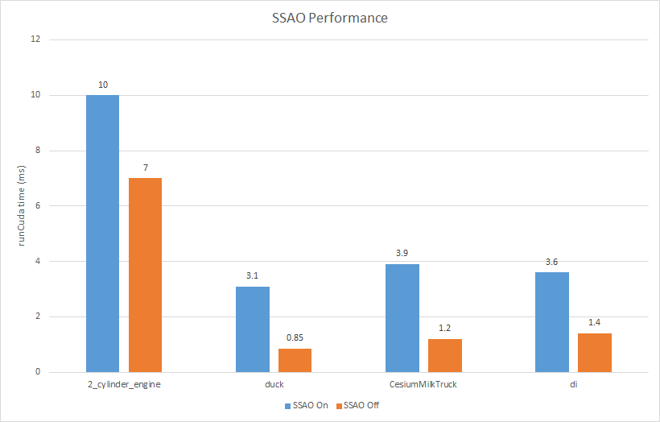
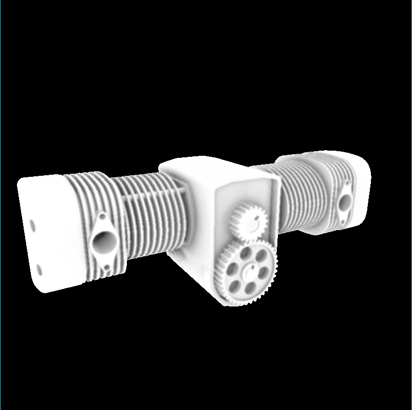
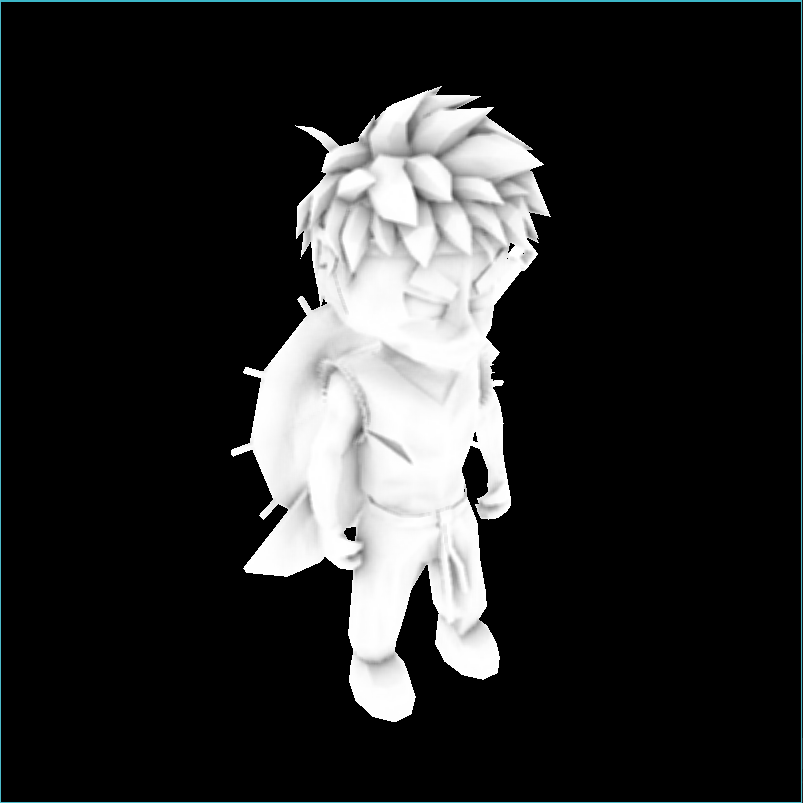
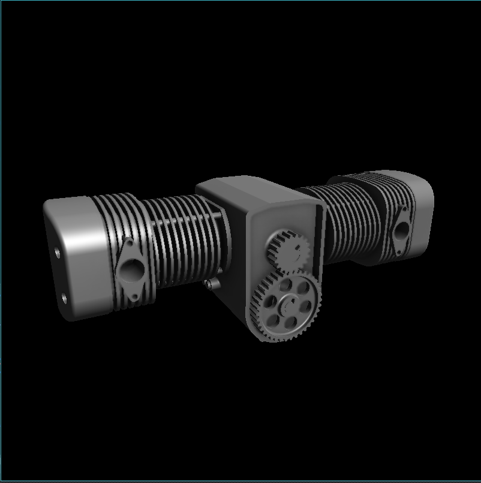
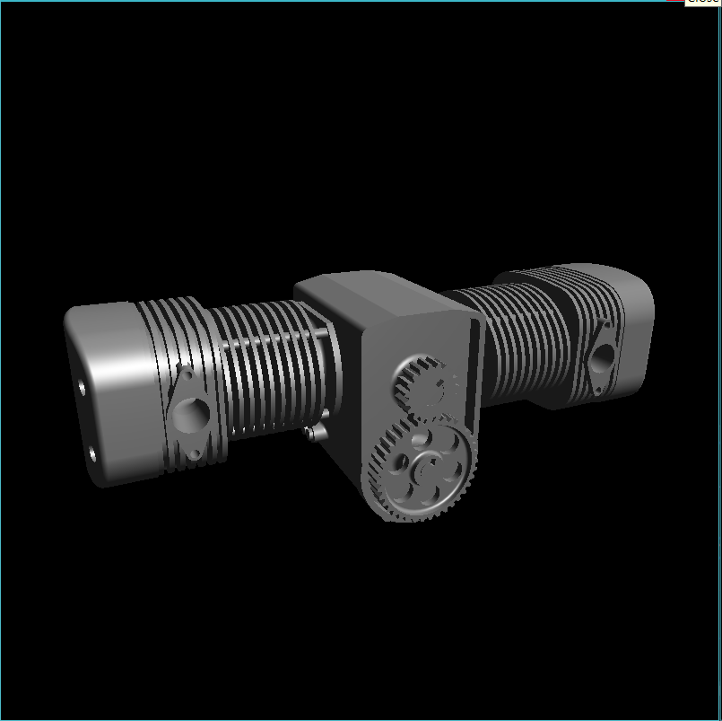

CUDA Rasterizer
===============

[CLICK ME FOR INSTRUCTION OF THIS PROJECT](./INSTRUCTION.md)

**University of Pennsylvania, CIS 565: GPU Programming and Architecture, Project 4**

* Jian Ru
* Tested on: Windows 10, i7-4850 @ 2.3GHz 16GB, GT 750M 2GB (Personal)

### Overview

**Summary:** A basic software rasterizer implemented in CUDA

**Features:**

* Basic pipeline
  * Vertex assembly and vertex shader
  * Primitive assembly
  * Rasterization
  * Depth test
  * Fragment shader
* SSAO
* Tile-based rasterization
* Texture mapping with perspective-correct interpolation and bilinear filtering
* Back face culling

**Result:**

### Performance Analysis

* SSAO
  * Implemented after due date. Please do not count it into my grade because I don't want to use my late days.
  * Screen space ambient occlusion darkens area where occlusion is likely to happen. The main idea is that you take a bunch of samples in the upper hemisphere and at run time, for each pixel, you transform the samples into eye space, randomly rotate them about z-axis, and align the z-axis of their local frame with the eye-space normal of the pixel. Then you project the samples onto screen space and compare their depth with the depth of the pixel at that point (need to use LINEAR depth). A sample is occluded if the pixel is before it (less deep). The goal is to compute the ratio of samples being occluded and darken pixel color accordingly.
  * SSAO is not physically accurate but it is usually visually plausible and cheap enough for real-time rendering. The effect is usually subtle but does enhance realism of object appearance.
  * In the test, I used 64 samples and a 4x4 noise texture. The cost is about 3 ms. This cost scales with render target resolution and is not affected by scene complexity.
  
  
  | 2_cylineder_engine | di |
  | --- | --- |
  |  |  |
  
  | SSAO On | SSAO Off |
  | --- | --- |
  |  |  |
* Tile-based rasterization
  * The following graph shows the performance of tile-based (with/without culling) and per-primitive rasterization tested on various 3D models. It shows that tile-based approach has better performance on models that have fewer but bigger triangles but it is slightly slower than the basic approach when the scene is composed of small triangles. Even if so, tile-based approach is more stable in terms of execution time and totally eliminates write conflicts. The drawback is that we need more memory to mantain a list of triangles for each tile. The size of extra memory required can be quite large if we choose to be safe and we may risk data corruption if we make it too small. Back face culling is important here because it can significantly reduce the number of triangles each tile may overlap and thus reduce the size of triangle list and improves performance.
  
  * Performance vs. tile size
    * I experimented several possible tile sizes and found that an 8x8 tile size works the best on my computer
    
    * According to the perf report from NSight, my tile-based rasterization kernel is expensive and resource demanding. It uses 63 register per thread (I tried to optimize on register usage but could not reduce the number further. I guess nvcc may have done the optimization already) and contains relatively complex logics. Given this nature, incrasing tile size doesn't improve occupancy before each SM has almost saturated (occupancy data from NSight agrees on this explanation), however, it increases the number of triangles each tile needs to process. Increasing execution complexity without incrasing occupancy, that is why increasing tile size from 8 doesn't improve performance. On the other hand, due to the active block limit of my GPU, further decrease tile size cannot increase the number of active blocks on each SM (occupancy data from NSight shows decreased occupancy from 50% to 25%). For a tile size of 4, each block contains only 16 threads, which is less than warp size. So half of the threads in a warp are doing nothing. This is also another reason not to decrease tile size further.
    
    
    | Tile Size 4 | Tile Size 8 |
    | --- | --- |
    |  |  |
    
    | Tile Size 16 | Tile Size 32 |
    | --- | --- |
    |  |  |
* Bilinear interpolation vs. Nearest Neighbor
  * Based on experimentation, bilinear texture filtering has small hit on performance but increase texture quality especially when the object is close to the camera.
  
  
  | Bilinear | Nearest Neighbor |
  | --- | --- |
  |  |  |

* Perspective correctness
  * Since the Barycentric coordinates of triangles are calculated in screen space, we cannot use it to perform linear interpolation directly. The main reason is that perspective projection doesn't preserver distance (parallel lines will converge to a single point after perspective projection). Luckily, people have found out that doing linear interpolation on the reciprocals of vertex depths (in eye space) does give perspective correct results for depth. For other vertex attributes, we can linearly interpolate each attribute scaled by the reciprocal of corresponding depth value and multiply the result by the correctly interpolated depth. So this leads to the implementation of perspective correct interpolation of vertex attributes (the effect is obvious when you have large textured triangles).
  
  | With Perspective Correction | Without Perspective Correction |
  | --- | --- |
  |  |  |

### Credits

* [tinygltfloader](https://github.com/syoyo/tinygltfloader) by [@soyoyo](https://github.com/syoyo)
* [glTF Sample Models](https://github.com/KhronosGroup/glTF/blob/master/sampleModels/README.md)
