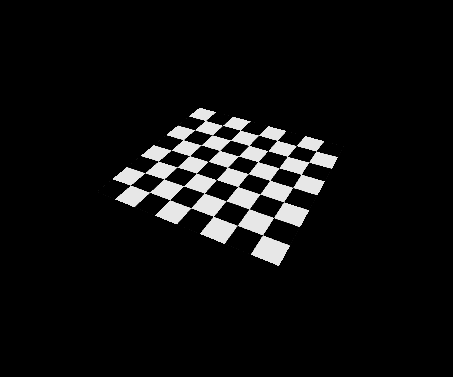
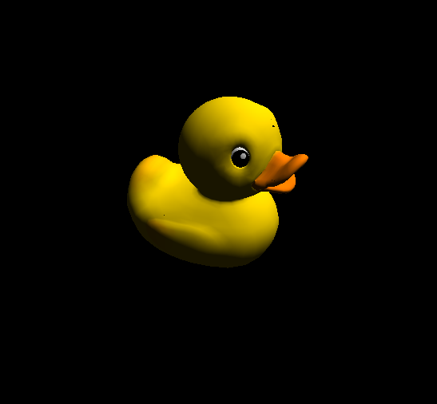
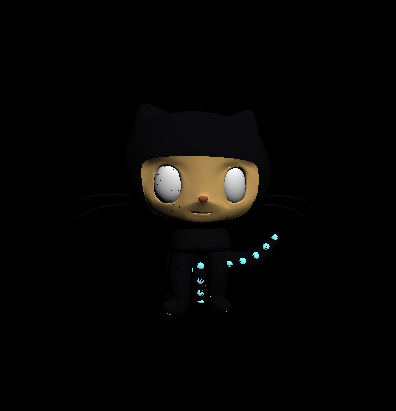
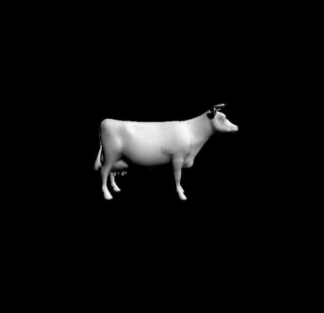

CUDA Rasterizer
================

**University of Pennsylvania, CIS 565: GPU Programming and Architecture, Project 3**

* Trung Le
* Windows 10 Home, i7-4790 CPU @ 3.60GHz 12GB, GTX 980 Ti (Person desktop)

# Rasterizer

------------

### Features

- [Perspective correct UV texture mapping with bilinear filtering](## UV Texture Mapping)
- [Order independent transparency using k-buffer](## Order independent transparency using k-buffer)

### Flags

The following header flags can be found in `rasterize.cu`:

- `#define RENDER_DEPTH_ONLY`: Uncomment to render with z-buffer only
- `#define RENDER_NORMAL_ONLY`: Uncomment to render with eye space normals only
- `#define BILINEAR_FILTERING`: Uncomment to enable bilinear filtering
- `#define NOT_USE_TEXTURE`: Uncomment if the model doesn't have a texture file (cow, centaur, 2 cylinder engine, wolf, octocat, flower)
- `#define USE_K_BUFFER`: Uncomment if using independent order transparency with k-buffer
- `#define SHARED_MEMORY_MATERIALS`: Uncomment to use shared memory for materials

(not working, please ignore)
- ~~`#define BACKFACE_CULLING`~~

The following header flags can be found in `main.cpp`:
- `#define USE_CENTAUR_MODEL`: Uncomment if using the `cent.gltf` model
- `#define USE_HEAD_MODEL`: Uncomment if using the `head.gltf` model
- `#define USE_ENGINE_MODEL`: Uncomment if using the `2_cylinder_engine.gltf` model
- `#define USE_TURNTABLE`: Uncomment to rotate model on a turntable

## UV Texture Mapping
### 1. Perspective correct

An attribute of a fragment inside a triangle can be computed by using barycentric interpolation of the triangle vertices. A naive approach for this interpolation is directly interpolate the attribute in raster space after the vertices have been projected onto the screen. However, since the projected vertices don't preserve the correct perspective, or depth, of the fragment computed, we have to perform [perspective correction](https://en.wikipedia.org/wiki/Perspective_correction). I implemented perspective correct UV texture mapping and depth interpolation using the explanation at [scratchapixel](http://www.scratchapixel.com/lessons/3d-basic-rendering/rasterization-practical-implementation/perspective-correct-interpolation-vertex-attributes).

Incorrect       | Correct
:-------------------------:|:-------------------------:
|

### 2. Bilinear filtering

Toggle with `#define BILINEAR_FILTERING`

[Bilinear filtering](https://en.wikipedia.org/wiki/Bilinear_filtering) is an antialiasing technique that averages the nearest four texels of the lookup texel to create smooth effect when the texture is zoomed in or zoomed out.

Below shows the comparison with bilinear filtering on (left) and off (right). Bilinear filtering makes the wavy curve on the Cesium logo appear to be smoother and not pixelated.

Bilinear **ON**        | Bilinear **OFF**
:-------------------------:|:-------------------------:
|

At first, I expected bilinear filtering might have a performace hit on the `_rasterize` function because of the nearest texels lookup. However, after profiling, it appears to only affect rasterization minimally. See the [performance analysis](# Performance analysis) section.

## Order independent transparency using k-buffer

Toggle with `#define USE_K_BUFFER`

k-buffer is a generalized version of the traditional z-buffer for depth. Instead of storing a single depth as in the z-buffer, k-buffer stores a list of depths for overlapping fragments. This information allows us to compute the alpha blending color of these multiple overlapping fragments in screenspace.

k-buffer **ON**        | k-buffer **OFF**
:-------------------------:|:-------------------------:
|
|

To make sure that colors from overlapping fragments are accumulated correctly, `atomicAdd` is used to synchronize across all threads that attempt to accumulate to the `dev_depthAccum` buffer.

---------------

# Performance analysis

_All profiling was done using NSight Performance Analysis tool with the following parameters_

| Parameters| Value |
|---|---|
| Primitves | 17684 |
| Runtime | 20,000 ms |
| Resolution | 800x800
| Kernel launches | 1091 |

### Kernel execution time

        | Scene used
:-------------------------:|:-------------------------:
|

The bottleneck happens in the `_rasterize` kernel because we have to loop through each pixel in every triangle's bounding box. Therefore, each `_rasterize` kernel is bounded by O(n2), where n is the size of the triangle's bounding box in screen space. This means that a large triangle with a large bounding box will have a performance hit. To compare, I profiled a scene with the head model where the camera is located at the origin, versus a scene where the camera is zoomed in.

### A close up at `_rasterize`

Camera at origin        | Camera zoomed in
:-------------------------:|:-------------------------:
|

As we can see, the `_rasterize` kernel increases significantly in kernel time because each triangle that it has to rasterize now has a larger area with more number of fragments.

### Kernel execution time vs. features

_Profile is done by enabling each feature one by one_

|        | Scene used
:-------------------------:|:-------------------------:
|

As expected, bilinear filtering and k-buffer occupy more device time. However, the performace decrease isn't significant enough. For the k-buffer, instead of using a linked list of depth buffers, I only created an additional buffer of accumulated alpha colors of overlapping fragments. This optimized for having to look several depth buffer, which could make memory read and write from global buffer slower. 

### Registers used vs. kernel

`_rasterize` and (interestingly) `_vertexTransformAndAssembly` take up a large number of registers, 112 and 95, respectively. This significantly severes the ability for GPU scheduler to optimize the number of active blocks per kernel launch. 

### Shared memory for materials 

To optimize for `render` kernel global memory read from materials list, this data is copied over to __shared__ memory. In the beginning of the `render` kernel call, threads within the same block will copy over the materials data from globabal memory to __shared__ memory. A CUDA `__syncthreads()` is used to make sure this shared data is initialized properly before used.

_The following uses three different scene with varying number of materials and ran for 20,000ms each:_

1 material | 5 materials | 115 materials
:-------------------------:|:-------------------------:|:-------------------------:
| | |

Let's take a look at the kernel analysis for `render`:

| Kernel time  | Occupancy
:-------------------------:|:-------------------------:
||

Looks quite bad! It seems that having sharing memory isn't that great at all. The occupancy for active warps are quite low. This is due to the fact that an additional step is required to transfer the materials data over from global so shared memory with a thread sync. 

----------------

# Incomplete feature

Backface culling is implemented, but without stream compaction. I only include here the reference renders for this feature but it is incomlete as to gain proper performace increase.

Flower with backface culling        | Flower with backface culling
:-------------------------:|:-------------------------:
|

--------------------------------

# Renders

### Models

| [Duck](gltfs/duck/duck.gltf) | [Wolf](gltfs/wolf/wolf.gltf) | [Octocat](gltfs/octocat/octocat.gltf) |
|---|---|---|
|4212 tris | 18342 tris | 15708 tris |
| |  |  |  

| [Centaur](gltfs/cent/cent.gltf) | [Cesium Milk Truck](gltfs/CesiumMilkTruck/CesiumMilkTruck.gltf) | [flower](gltfs/flower/flower.gltf) |
|---|---|---|
| 34670 tris | 3624 tris | 640 tris | 
|  |  |   | 

|[cow](gltfs/cow/cow.gltf) | [gltf](gltfs/head/head.gltf) | [gltfs](gltf/2_cylinder_engine/2_cylinder_engine.gltf) |
|---|---|---|
| 5804 tris | 17684 tris | 121496 tris | 
 |  |  | 

### Renders of normal and depth attributes:

Diffuse        | Normal | Depth |
:-------------------------:|:-------------------------:|:-------------------------:
||

# Bonus artistic renders!

When `float` and `int` conversion goes wrong...

| | | |
|---|---|---|
| |  | |

When your ghost friend won't stop staring at you :-)

--------------------------------

# Device information

### General information for CUDA device
- Device name: GeForce GTX 980 Ti
- Compute capability: 5.2
- Compute mode: Default
- Clock rate: 1076000
- Integrated: 0
- Device copy overlap: Enabled
- Kernel execution timeout: Enabled
 
### Memory information for CUDA device

- Total global memory: 6442450944
- Total constant memory: 65536
- Multiprocessor count: 22
- Shared memory per multiprocessor: 98304
- Registers per multiprocessor: 65536
- Max threads per multiprocessor: 2048
- Max grid dimensions: [2147483647, 65535, 65535]
- Max threads per block: 1024
- Max registers per block: 65536
- Max thread dimensions: [1024, 1024, 64]
- Threads per block: 512

--------------------------------

### Credits

* [tinygltfloader](https://github.com/syoyo/tinygltfloader) by [@soyoyo](https://github.com/syoyo)
* [obj2gltf](https://github.com/AnalyticalGraphicsInc/OBJ2GLTF) by [AnalyticalGraphicsInc](https://github.com/AnalyticalGraphicsInc)
* [Implementing Weighted, Blended Order-Independent Transparency](http://casual-effects.blogspot.com/2015/03/implemented-weighted-blended-order.html) by Morgan McGuire
* [k-buffer](http://www.inf.ufrgs.br/~comba/papers/2007/kbuffer_preprint.pdf) by Morgan McGuire

### Models
* [glTF Sample Models](https://github.com/KhronosGroup/glTF/blob/master/sampleModels/README.md)
* [octocat]() by [Sally Kong](https://sketchfab.com/models/cad2ffa5d8a24423ab246ee0916a7f3e). Model is converted using [obj2gltf](https://github.com/AnalyticalGraphicsInc/OBJ2GLTF).
* [wolf]() by [Rachel Hwang](https://www.linkedin.com/in/rachel-hwang-84a3b989). Model is converted using [obj2gltf](https://github.com/AnalyticalGraphicsInc/OBJ2GLTF).
* [centaur model](http://tf3dm.com/3d-model/free-base-mesh-centaur--67384.html) by [BAQStudio](http://tf3dm.com/user/baqstudio), Model is converted using [obj2gltf](https://github.com/AnalyticalGraphicsInc/OBJ2GLTF).
* Infinite, [3D Head Scan]() by Lee Perry-Smith is licensed under a Creative Commons Attribution 3.0 Unported License. Based on a work at www.triplegangers.com. This distribution was created by Morgan McGuire and Guedis Cardenas http://graphics.cs.williams.edu/data/. See [LICENSE](/gltfs/head/Infinite-Scan_License.txt). Model is converted using [obj2gltf](https://github.com/AnalyticalGraphicsInc/OBJ2GLTF).

